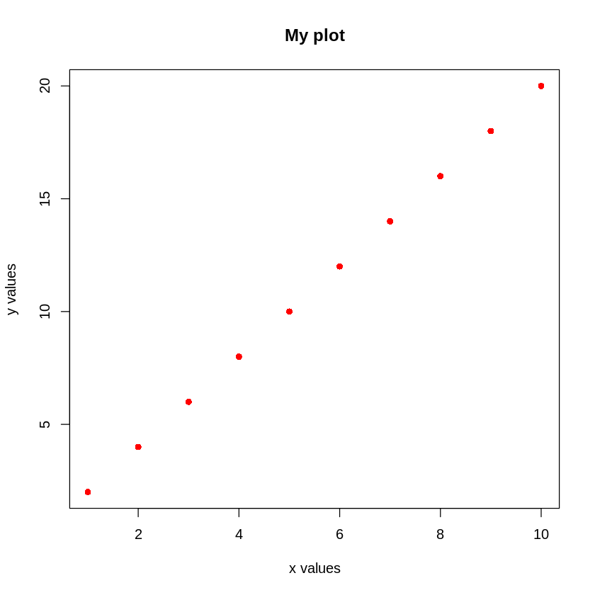
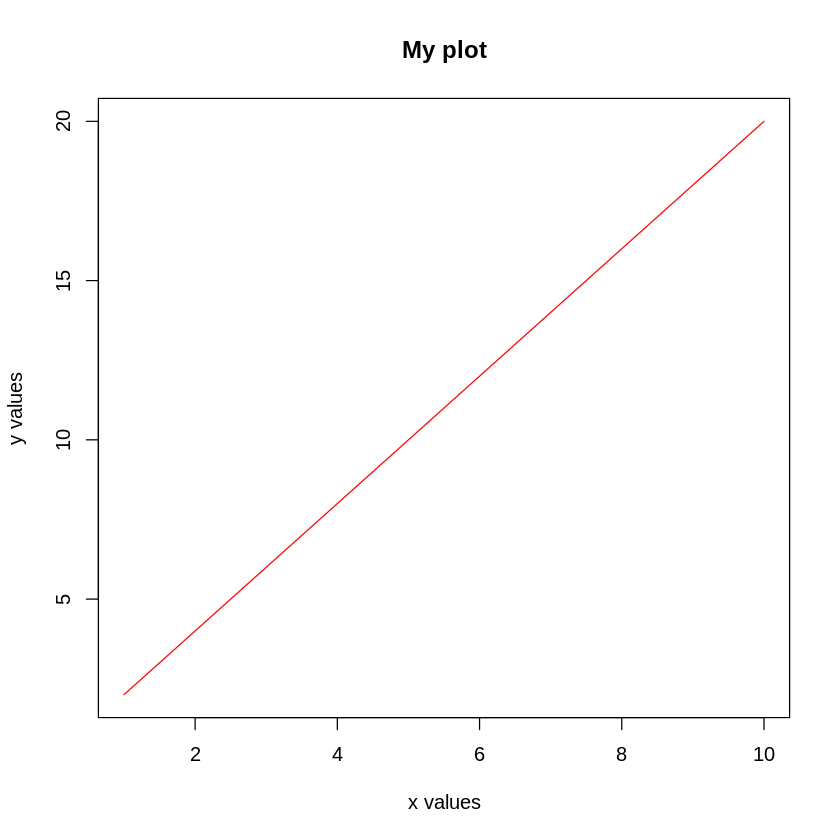
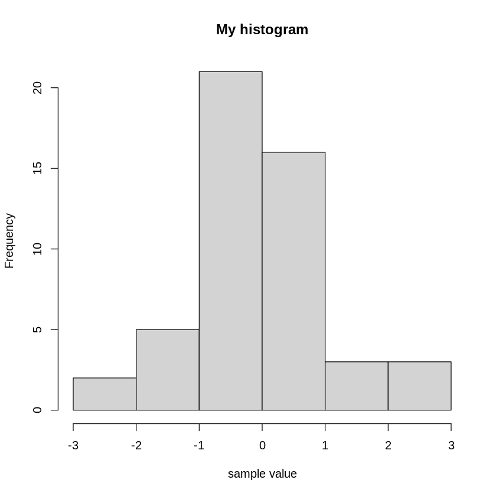
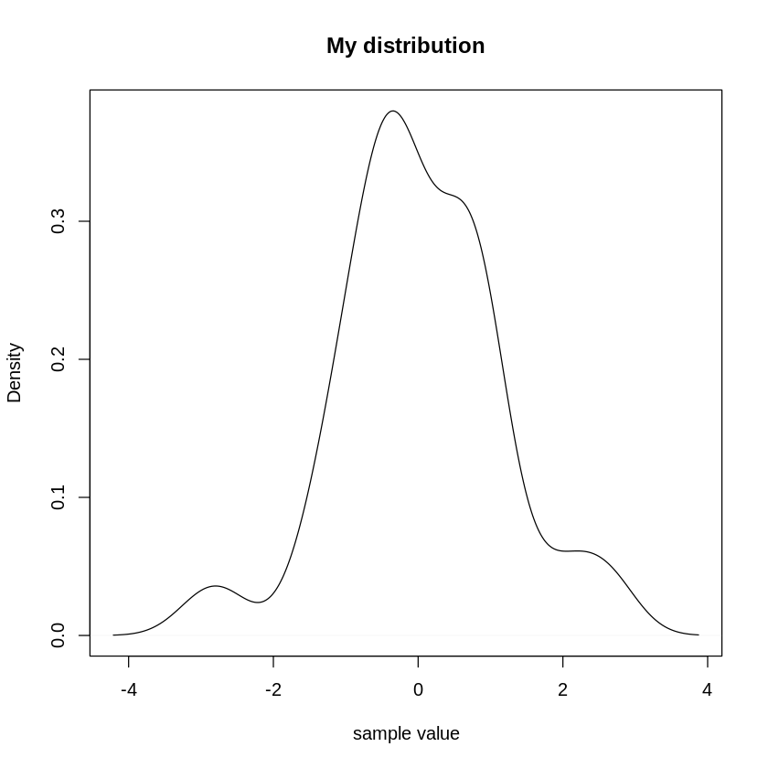
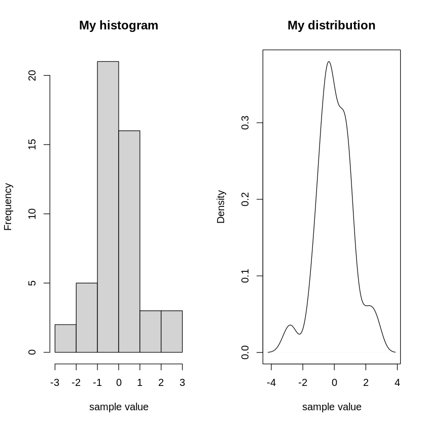
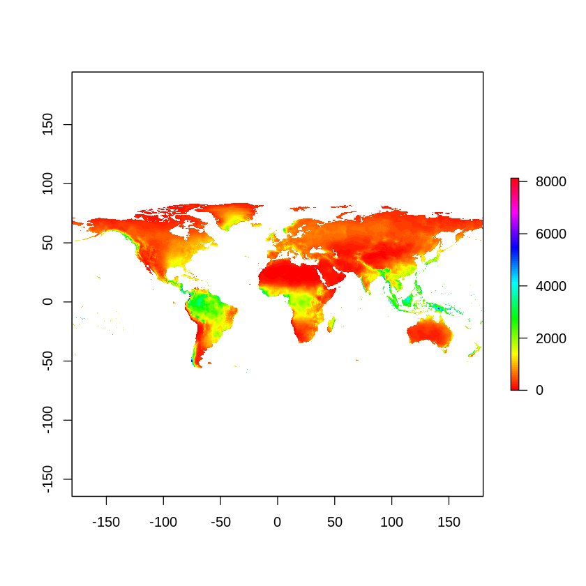
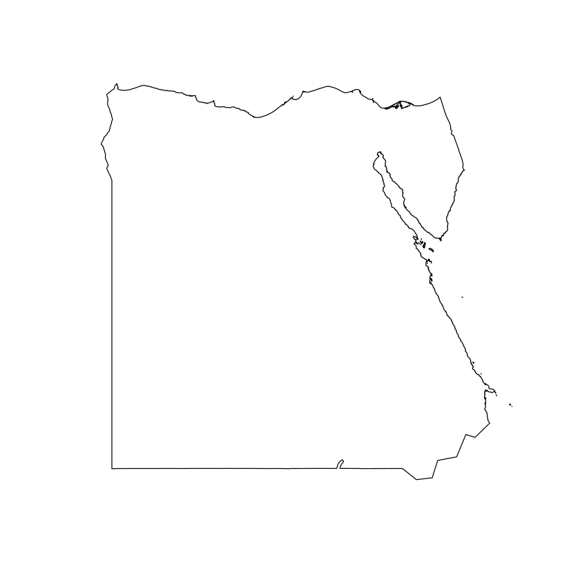
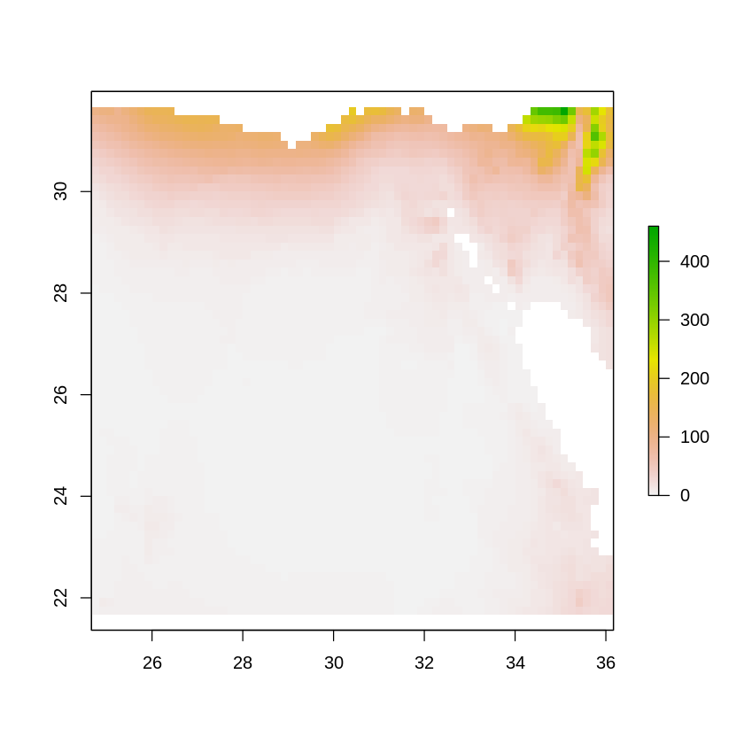
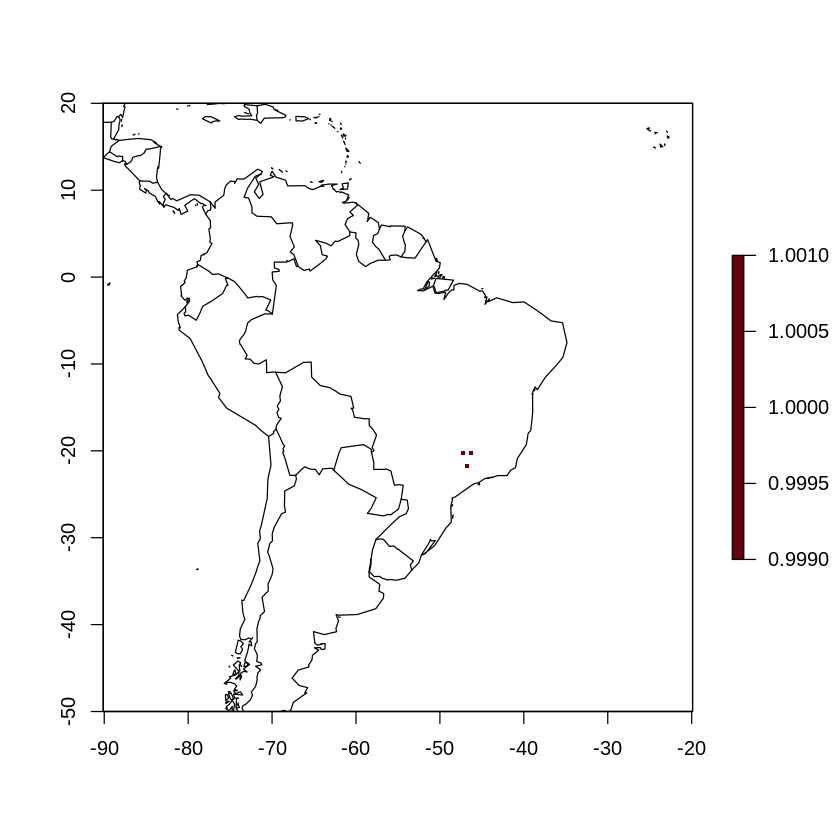
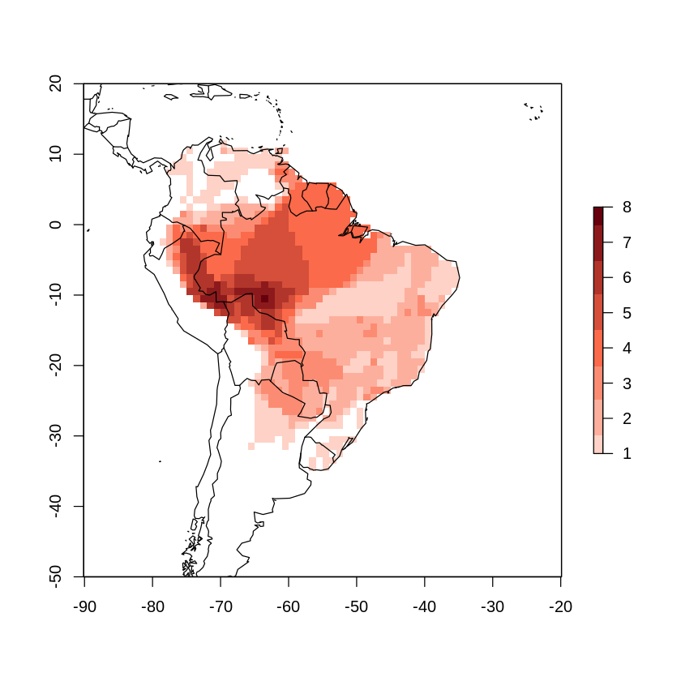

## Basics in R

### 1. Introduction and resources

The aim of this practical is to revise some basic functions in `R` relating to data management and plotting. We will then look at handling spatial data.

For your practicals we will be using `RStudio`. `RStudio` is a IDE (Interactive Development Environment) that is designed especially for `R`. IDEs can highlight different types of codes (comments or strings for example), and give you error messages if it looks like something is wrong. That makes `RStudio` a great choice for working in `R`.

Practicals will be in the format of notebooks, and you should type the code in each block into your own `RStudio` environment on your laptop. You will learn much more from manually typing each block of code into `RStudio` than by copying and pasting, so try not be tempted! For anyone who has trouble with accessing or running `R`/`RStudio` on their own laptop or a university computer, we have a second option to run the notebooks online in a browser using `google colab`. However, coding your coursework (and future work!) will be easier if you've taken the time to set up your own R environment on your laptop, so this should be a last resort!


#### Working directory and using scripts

The first step when starting a new session is to set your working directory. Think of it as the 'folder' that you work out of on your computer. Unless you specify differently, anything that you read in or save will be in this folder. The working directory is set using the function `setwd()` and the path to the folders location, for example:

`setwd("C:/Users/rb417/Desktop/BCB_Practicals")`

You can also see what folder you're currently in:

`getwd()`

I recomend storing all the files you need for the practicals in one folder called "BCB_Practicals", and setting your working directory to this folder at the start of each R session. If you're in `RStudio` you can also use `Tools -> Global Options` to change your default working directory to your preferred folder.

Remember that you can find the R help for a particular function by using `?function` or `??function` e.g. `?setwd`. Also recall that `ls()` lists and `rm(list=ls())` clears your workspace.

You can open a new script by going to `File -> New File -> R script`. Also on windows you can type `CTRL + SHIFT + N`. Remember that when you save this script you need to add .R (Practical1.R). Save often! Although you can write commands directly into the console window, using a script allows you to save a record of your code that can easily be re-run. This is particuarly useful if you find a mistake later on, or want to update models with new data. 

To run a single line of your script at a time in windows, a convinent short cut is `CTRL + ENTER`.


#### Installing packages for practicals

To ease potential online working, we've compiled a script of packages to install, called `install.R`. To run this you can either open the script in `RStudio` and run each line, or you can save time using this code: 

`source("install.R")`

Just make sure the install.R file is saved in your current directory. Or specify the location using a filepathway such as: 

`source("C:/Users/rb417/Desktop/BCB_Practicals/install.R")`.

Mac and Linux users may have into install `GDAL` on their laptop. This is software for handling spatial data, which R uses and is preinstalled on Windows. This can be done from the Mac terminal using homebrew:

First install homebrew if you haven't by copying this code into your terminal:

`/bin/bash -c "$(curl -fsSL https://raw.githubusercontent.com/Homebrew/install/master/install.sh)"`

Then install GDAL by running this code:

`brew install gdal`

Linux users can use the commands (will install other spatial packages): 

`sudo apt-get update`

`sudo apt-get install libgdal-dev libproj-dev libgeos-dev libudunits2-dev libv8-dev libprotobuf-dev libjq-dev`

### 2. Revision of data types

We'll start with some basics data manipulation in R to get started. 

For anyone unfamiliar, '#' proceeds comments in scripts that won't be acted on by R, which allows us to label our scripts. Comments are very useful! Try and make as many comments as possible, and use more detail than you think you need. You'd be suprised how quickly you can forget what a function or script does, so detailed comments are a lifesaver!


```R
# We'll first try defining some basic variables

# A number
a <- 5.7
a
class(a)
```


5.7


'numeric'


```R
# A string
b <- "hello"
b
class(b)
```


'hello'


'character'


```R
# A logical object
c <- TRUE
c
class(c)
```


TRUE


'logical'


In R variables are stored as vectors. Often vectors will be lists of variables such as 1,2,3,4,5. However, even single variables are still stored as vectors! Try `is.vector()` on each of the variables you just created to see! Vectors are one of the most basic (and useful) ways of storing data in R.

Now we'll try creating some basic vectors and manipulating them.


```R
# Generates a sequence from 0 to 9 by intervals of 1. Try ?seq() for more information
d <- seq(0, 9, 1) 
d
```


<style>
.list-inline {list-style: none; margin:0; padding: 0}
.list-inline>li {display: inline-block}
.list-inline>li:not(:last-child)::after {content: "\00b7"; padding: 0 .5ex}
</style>
<ol class="list-inline"><li>0</li><li>1</li><li>2</li><li>3</li><li>4</li><li>5</li><li>6</li><li>7</li><li>8</li><li>9</li></ol>


```R
# Cocatenate variables into one vector
e <- c(0,1,2,3,4,5,6,7,8,9)
e
```


<style>
.list-inline {list-style: none; margin:0; padding: 0}
.list-inline>li {display: inline-block}
.list-inline>li:not(:last-child)::after {content: "\00b7"; padding: 0 .5ex}
</style>
<ol class="list-inline"><li>0</li><li>1</li><li>2</li><li>3</li><li>4</li><li>5</li><li>6</li><li>7</li><li>8</li><li>9</li></ol>


`c()` is one of the most used functions in R! It allows you to join together two objects. For example: 


```R
f <- c(d,e)
f
```


<style>
.list-inline {list-style: none; margin:0; padding: 0}
.list-inline>li {display: inline-block}
.list-inline>li:not(:last-child)::after {content: "\00b7"; padding: 0 .5ex}
</style>
<ol class="list-inline"><li>0</li><li>1</li><li>2</li><li>3</li><li>4</li><li>5</li><li>6</li><li>7</li><li>8</li><li>9</li><li>0</li><li>1</li><li>2</li><li>3</li><li>4</li><li>5</li><li>6</li><li>7</li><li>8</li><li>9</li></ol>


```R
# Vectors can also be strings or logicals
g <- c("red","blue","green")
g
class(g)
```


<style>
.list-inline {list-style: none; margin:0; padding: 0}
.list-inline>li {display: inline-block}
.list-inline>li:not(:last-child)::after {content: "\00b7"; padding: 0 .5ex}
</style>
<ol class="list-inline"><li>'red'</li><li>'blue'</li><li>'green'</li></ol>


'character'


```R
h <- c(TRUE, TRUE, FALSE)
h
class(h)
```


<style>
.list-inline {list-style: none; margin:0; padding: 0}
.list-inline>li {display: inline-block}
.list-inline>li:not(:last-child)::after {content: "\00b7"; padding: 0 .5ex}
</style>
<ol class="list-inline"><li>TRUE</li><li>TRUE</li><li>FALSE</li></ol>


'logical'


```R
# find the length of a vector
length(e) 
```


10


```R
# Indexing is an easy way to pull out certain elements of a vector based on their position
e[1] # the first element

e[5] # the fifth element

e[10] # the tenth element
```


0


4


9


```R
# Indexing can also pull out groups of variables

e[1:5] # elements 1 to 5

e[c(1,4)] # elements 1 and 4

e[-4] # e without the fourth element
```


<style>
.list-inline {list-style: none; margin:0; padding: 0}
.list-inline>li {display: inline-block}
.list-inline>li:not(:last-child)::after {content: "\00b7"; padding: 0 .5ex}
</style>
<ol class="list-inline"><li>0</li><li>1</li><li>2</li><li>3</li><li>4</li></ol>


<style>
.list-inline {list-style: none; margin:0; padding: 0}
.list-inline>li {display: inline-block}
.list-inline>li:not(:last-child)::after {content: "\00b7"; padding: 0 .5ex}
</style>
<ol class="list-inline"><li>0</li><li>3</li></ol>


<style>
.list-inline {list-style: none; margin:0; padding: 0}
.list-inline>li {display: inline-block}
.list-inline>li:not(:last-child)::after {content: "\00b7"; padding: 0 .5ex}
</style>
<ol class="list-inline"><li>0</li><li>1</li><li>2</li><li>4</li><li>5</li><li>6</li><li>7</li><li>8</li><li>9</li></ol>


Vectors can be combined into a matrix.


```R
numbers <- c(1,2,3,4,5)
other.numbers <- c(6,7,8,9,10)
all.numbers <- cbind(numbers, other.numbers) # cbind is short for column bind, which joins two vectors together as columns
all.numbers
```


<table>
<caption>A matrix: 5 × 2 of type dbl</caption>
<thead>
	<tr><th scope=col>numbers</th><th scope=col>other.numbers</th></tr>
</thead>
<tbody>
	<tr><td>1</td><td> 6</td></tr>
	<tr><td>2</td><td> 7</td></tr>
	<tr><td>3</td><td> 8</td></tr>
	<tr><td>4</td><td> 9</td></tr>
	<tr><td>5</td><td>10</td></tr>
</tbody>
</table>


```R
class(all.numbers)
```


<style>
.list-inline {list-style: none; margin:0; padding: 0}
.list-inline>li {display: inline-block}
.list-inline>li:not(:last-child)::after {content: "\00b7"; padding: 0 .5ex}
</style>
<ol class="list-inline"><li>'matrix'</li><li>'array'</li></ol>


Dataframes are special case of matrices, where each column can be a different type. Often this is how ecological data will be collected and stored. This is also most often what you will be handling in R.


```R
numbers <- c(1,2,3,4,5)
characters <- c("a","b","c","d","e")
both.types <- cbind(numbers, characters)
both.types
```


<table>
<caption>A matrix: 5 × 2 of type chr</caption>
<thead>
	<tr><th scope=col>numbers</th><th scope=col>characters</th></tr>
</thead>
<tbody>
	<tr><td>1</td><td>a</td></tr>
	<tr><td>2</td><td>b</td></tr>
	<tr><td>3</td><td>c</td></tr>
	<tr><td>4</td><td>d</td></tr>
	<tr><td>5</td><td>e</td></tr>
</tbody>
</table>


```R
class(both.types)
```


'data.frame'


What happened there? 'both.types' was a matrix and not a dataframe. Be careful combining strings and numbers together without specifying that you want a dataframe. R will coerce the numbers in strings, so each value is represented as "1", "2", "3"... rather than as actual numbers.


```R
both.types[numbers]
class(both.types[numbers])
```


<style>
.list-inline {list-style: none; margin:0; padding: 0}
.list-inline>li {display: inline-block}
.list-inline>li:not(:last-child)::after {content: "\00b7"; padding: 0 .5ex}
</style>
<ol class="list-inline"><li>'1'</li><li>'2'</li><li>'3'</li><li>'4'</li><li>'5'</li></ol>


'character'


Instead try being more explicit.


```R
both.types <- data.frame(numbers, characters)
both.types
```


<table>
<caption>A data.frame: 5 × 2</caption>
<thead>
	<tr><th scope=col>numbers</th><th scope=col>characters</th></tr>
	<tr><th scope=col>&lt;dbl&gt;</th><th scope=col>&lt;chr&gt;</th></tr>
</thead>
<tbody>
	<tr><td>1</td><td>a</td></tr>
	<tr><td>2</td><td>b</td></tr>
	<tr><td>3</td><td>c</td></tr>
	<tr><td>4</td><td>d</td></tr>
	<tr><td>5</td><td>e</td></tr>
</tbody>
</table>


```R
class(both.types)
class(both.types$numbers)
```


'data.frame'


'numeric'


**An important note: It's tempting to name variables as single letters (a, b, c) as we did at the beginning of the practical. However, for anything slightly more complex than what we've done this becomes confusing very quickly. It's much better to use longer variables like 'numbers' or 'letters'. This describes what the variable is, and makes it easier for yourself and others to read your code and understand it! An easy way to separate words is to use periods '.' or underscores '_'.**

Dataframes have lots of useful functions that make them easy to use. First we'll make a slightly longer dataframe.


```R
small.numbers <- seq(1, 10, 1)
large.numbers <- seq(100, 1000, 100)

all.numbers <- data.frame(small.numbers, large.numbers)
all.numbers
```


<table>
<caption>A data.frame: 10 × 2</caption>
<thead>
	<tr><th scope=col>small.numbers</th><th scope=col>large.numbers</th></tr>
	<tr><th scope=col>&lt;dbl&gt;</th><th scope=col>&lt;dbl&gt;</th></tr>
</thead>
<tbody>
	<tr><td> 1</td><td> 100</td></tr>
	<tr><td> 2</td><td> 200</td></tr>
	<tr><td> 3</td><td> 300</td></tr>
	<tr><td> 4</td><td> 400</td></tr>
	<tr><td> 5</td><td> 500</td></tr>
	<tr><td> 6</td><td> 600</td></tr>
	<tr><td> 7</td><td> 700</td></tr>
	<tr><td> 8</td><td> 800</td></tr>
	<tr><td> 9</td><td> 900</td></tr>
	<tr><td>10</td><td>1000</td></tr>
</tbody>
</table>


```R
# Get the top 6 values
head(all.numbers)
```


<table>
<caption>A matrix: 5 × 2 of type dbl</caption>
<thead>
	<tr><th scope=col>numbers</th><th scope=col>other.numbers</th></tr>
</thead>
<tbody>
	<tr><td>1</td><td> 6</td></tr>
	<tr><td>2</td><td> 7</td></tr>
	<tr><td>3</td><td> 8</td></tr>
	<tr><td>4</td><td> 9</td></tr>
	<tr><td>5</td><td>10</td></tr>
</tbody>
</table>


```R
# Get the bottom 6 values
tail(all.numbers)
```


<table>
<caption>A matrix: 5 × 2 of type dbl</caption>
<thead>
	<tr><th></th><th scope=col>numbers</th><th scope=col>other.numbers</th></tr>
</thead>
<tbody>
	<tr><th scope=row>[1,]</th><td>1</td><td> 6</td></tr>
	<tr><th scope=row>[2,]</th><td>2</td><td> 7</td></tr>
	<tr><th scope=row>[3,]</th><td>3</td><td> 8</td></tr>
	<tr><th scope=row>[4,]</th><td>4</td><td> 9</td></tr>
	<tr><th scope=row>[5,]</th><td>5</td><td>10</td></tr>
</tbody>
</table>


```R
#Get the structure of the dataframe
str(both.types)
```

    'data.frame':	5 obs. of  2 variables:
     $ numbers   : num  1 2 3 4 5
     $ characters: chr  "a" "b" "c" "d" ...


```R
# Get the number of rows and columns
nrow(all.numbers)
ncol(all.numbers)
```


10


2


```R
# Change the column names
colnames(all.numbers) <- c("small_numbers", "large_numbers")
colnames(all.numbers)
```


<style>
.list-inline {list-style: none; margin:0; padding: 0}
.list-inline>li {display: inline-block}
.list-inline>li:not(:last-child)::after {content: "\00b7"; padding: 0 .5ex}
</style>
<ol class="list-inline"><li>'small_numbers'</li><li>'large_numbers'</li></ol>


```R
# Change just one column name
colnames(all.numbers)[1] <- "one_to_ten"
colnames(all.numbers)
```


<style>
.list-inline {list-style: none; margin:0; padding: 0}
.list-inline>li {display: inline-block}
.list-inline>li:not(:last-child)::after {content: "\00b7"; padding: 0 .5ex}
</style>
<ol class="list-inline"><li>'one_to_ten'</li><li>'large_numbers'</li></ol>


   
   
  
Indexing dataframes is similar to indexing vectors. The only difference is now there is two dimensions, separated with commas. You can also leave either dimension blank to select all the rows or columns.


```R
# First row and first column
all.numbers[1,1]
```


<strong>one_to_ten:</strong> 1


```R
# First column
all.numbers[,1]
```


<style>
.list-inline {list-style: none; margin:0; padding: 0}
.list-inline>li {display: inline-block}
.list-inline>li:not(:last-child)::after {content: "\00b7"; padding: 0 .5ex}
</style>
<ol class="list-inline"><li>1</li><li>2</li><li>3</li><li>4</li><li>5</li></ol>


```R
# First row (because columns can contain different data types, selecting accross a row returns a dataframe)
all.numbers[1,]
```


<style>
.dl-inline {width: auto; margin:0; padding: 0}
.dl-inline>dt, .dl-inline>dd {float: none; width: auto; display: inline-block}
.dl-inline>dt::after {content: ":\0020"; padding-right: .5ex}
.dl-inline>dt:not(:first-of-type) {padding-left: .5ex}
</style><dl class="dl-inline"><dt>one_to_ten</dt><dd>1</dd><dt>large_numbers</dt><dd>6</dd></dl>


```R
# You can also specify columns in a dataframe by using column names in two ways:

#Get the small numbers
all.numbers$one_to_ten

#Get the large numbers (the comma specifies to take them from all rows. Try adding in indexes to the left of the comma)
all.numbers[,"large_numbers"]
```


<style>
.list-inline {list-style: none; margin:0; padding: 0}
.list-inline>li {display: inline-block}
.list-inline>li:not(:last-child)::after {content: "\00b7"; padding: 0 .5ex}
</style>
<ol class="list-inline"><li>1</li><li>2</li><li>3</li><li>4</li><li>5</li><li>6</li><li>7</li><li>8</li><li>9</li><li>10</li></ol>


<style>
.list-inline {list-style: none; margin:0; padding: 0}
.list-inline>li {display: inline-block}
.list-inline>li:not(:last-child)::after {content: "\00b7"; padding: 0 .5ex}
</style>
<ol class="list-inline"><li>100</li><li>200</li><li>300</li><li>400</li><li>500</li><li>600</li><li>700</li><li>800</li><li>900</li><li>1000</li></ol>


### 3. Reading, writing and .Rdata files ###

Because we're working with jupyter notebooks we won't cover reading and writing in much detail. Briefly, you can export data (especially dataframes) using a few simple functions: 

As a tab-separated text file

`write.table(dataframe.to.export, file="data.txt",sep="\t", row.names=FALSE)`

As a comma-separated file

`write.csv(dataframe.to.export, file="data.csv", row.names=FALSE)`

To read files back in: 

`new.data <- read.table("data.txt",header=TRUE,sep="\t")` 

`new.data <- read.csv("data.csv")`


Objects can also be saved as .RData and loaded back into R at a later time using save() and load(). This is handy when models may take a long time to run, and you don't have to rerun them everytime you start a new R session.

### 4. Plotting data

R can be used to produce a wide array of plots and has a large capacity for customisation. We will touch upon some basic plots which are useful to visual data during your analysis. For more advanced plots, most biolgists use the package *ggplot2*. A useful guide is the R cookbook, that includes information on customising plots: http://www.cookbook-r.com/Graphs/


We'll start with a scatterplot.


```R
# Create some data
x<-(1:10)
y<-seq(2,20,2)

# Plot a basic scatter plot
plot(x, y, pch=16, col="red", main="My plot", xlab="x values", ylab="y values")
```





`pch` stands for 'point character' and is the symbol to denote values. Try changing it to other values!

You can also get R to plot the scatter plot as a single line using `type = "l"`


```R
plot(x, y, col="red", main="My plot", xlab="x values", ylab="y values", type = "l")
```





Some of the most useful plots for visualling the spread of data are histograms and density plots. R comes built in with functions for sampling distributions we can use for plots.


```R
# Sample fifty points randomly from a normal distribution (try taking more or less samples to create smoother curves)
normal.distribution <-rnorm(50)

# Plot a histogram
hist(normal.distribution, main = "My histogram", xlab = "sample value")

# Plot a density plot instead (where frequency of samples is normalised to sum to 1)
plot(density(normal.distribution), main = "My distribution", xlab = "sample value")
```








```R
# You can change the grapical parameters to plot graphs side by side
par(mfrow=c(1,2))
hist(normal.distribution, main = "My histogram", xlab = "sample value")
plot(density(normal.distribution), main = "My distribution", xlab = "sample value")
```





```R
# To reset your graph parameters to the default, simply turn off the open graphical device
dev.off()
```


<strong>null device:</strong> 1


When plotting histograms, you can also use the arguement `breaks = n` to manually set the number of breaks. Plots can also be saved as objects for future use the same way as assigning any object. Also look at the functions barplot() and boxplot(). 

You can export your plots using pdf(), jpeg() or png()


```R
# Opens a new graphical device called 'my.plot.name.jpg' in the current working directory
jpeg("My.plot.name.jpg")

# Create a plot as usual
hist(normal.distribution, main = "My histogram", xlab = "sample value")

# Turn off the device to save any changes
dev.off()
```


<strong>png:</strong> 2


### 5. Handling spatial data

As conservation biologists, you'll often be required to handle spatial data. This might be for plotting species' ranges, predicting distributions, redlist criteria, and many other reasons. There are two common methods for handling spatial data, using GIS software such as ARCGIS, or using R. Whilst GIS softward is tempting because of its visual interface, I would recomend using R. Because you can easily save and rerun your scripts, you can perform repeatable analyses that isn't always possible when clicking buttons in a visual interface. You can also upload your scripts when you publish papers, so that others can verify your results. Furthermore, you'll often have to do statistical tests on your spatial data, and R has a multitude of packages to achieve this. For this practical we'll introduce you to handling simple spatial data.

Spatial data is available in a number of formats. Shapefiles contain spatial vector data for example spatial lines, points or polygons. Rasters contain a grid of values in pixels. In this session we will look at some examples.

First we will look at plotting rasters from the WorldClim dataset (Hijmans et al. 2005). Specifically, we want bioclim variables which are often used to describe species' environmental niches. Google for more info!


```R
# Load the raster package for spatial data
library(raster)

# getData is a function from the raster package that allows us to download some spatial data. 
bio <- getData("worldclim", var="bio", res=10)

# Get the class for our rasters
class(bio)

# Return details of our rasters
bio
```


'RasterStack'


    class      : RasterStack 
    dimensions : 900, 2160, 1944000, 19  (nrow, ncol, ncell, nlayers)
    resolution : 0.1666667, 0.1666667  (x, y)
    extent     : -180, 180, -60, 90  (xmin, xmax, ymin, ymax)
    crs        : +proj=longlat +datum=WGS84 +ellps=WGS84 +towgs84=0,0,0 
    names      :  bio1,  bio2,  bio3,  bio4,  bio5,  bio6,  bio7,  bio8,  bio9, bio10, bio11, bio12, bio13, bio14, bio15, ... 
    min values :  -269,     9,     8,    72,   -59,  -547,    53,  -251,  -450,   -97,  -488,     0,     0,     0,     0, ... 
    max values :   314,   211,    95, 22673,   489,   258,   725,   375,   364,   380,   289,  9916,  2088,   652,   261, ... 


We've downloaded 19 raster layers, with different information on rainfall, temperature, and other environmental predictors. They are organised in a 'stack', which is like a list of raster layers. As you can see rasters have dimensions (the number of cells), a resolution (the size of each cell), an extent (where it is located geographically) and a crs, coordinate reference system (the set of coordinates used). When working with spatial data you must ensure all files use the same coordinate system. If different objects use different coordinate systems you will need to reproject them to the same system using a function such as `spTransform()`.

We can also use indexing to extract a specfic raster:


```R
# Using one set of [] returns a 'list' of length 1 with the raster inside.
class(bio[12])

# Using two sets of [] returns the actual raster layer.
class(bio[[12]])

# Return the raster layer
bio[[12]]
```


<style>
.list-inline {list-style: none; margin:0; padding: 0}
.list-inline>li {display: inline-block}
.list-inline>li:not(:last-child)::after {content: "\00b7"; padding: 0 .5ex}
</style>
<ol class="list-inline"><li>'matrix'</li><li>'array'</li></ol>


'RasterLayer'


    class      : RasterLayer 
    dimensions : 900, 2160, 1944000  (nrow, ncol, ncell)
    resolution : 0.1666667, 0.1666667  (x, y)
    extent     : -180, 180, -60, 90  (xmin, xmax, ymin, ymax)
    crs        : +proj=longlat +datum=WGS84 +ellps=WGS84 +towgs84=0,0,0 
    source     : /content/My Git Repo/My Git Repo/My Git Repo/wc10/bio12.bil 
    names      : bio12 
    values     : 0, 9916  (min, max)


Remember to use two square brackets to get the actual raster.

Now let's try plotting our raster.


```R
# Create a scale of 100 rainbow colours
rainbow_colours <- rainbow(100)

# plot annual precipitation (mm) with our colours
plot(bio[[12]], col=rainbow_colours)
```





You can also create blank rasters of the desired extent and resolution. The following code creates a raster of the same extent and resolution as the precipitation raster. We can also assign values to the cells, such as 0 in this case.


```R
# Create a blank raster
blank_raster <- raster(res=0.1666667,xmn=-180,xmx=180,ymn=-60,ymx=90,
                  crs="+proj=longlat +datum=WGS84 +towgs84=0,0,0")

# We can assign values to all the cells
values(blank_raster) <- 0

# Return the raster
blank_raster
```


    class      : RasterLayer 
    dimensions : 900, 2160, 1944000  (nrow, ncol, ncell)
    resolution : 0.1666667, 0.1666667  (x, y)
    extent     : -180, 180.0001, -60.00003, 90  (xmin, xmax, ymin, ymax)
    crs        : +proj=longlat +datum=WGS84 +towgs84=0,0,0 +ellps=WGS84 
    source     : memory
    names      : layer 
    values     : 0, 0  (min, max)


Rasters can also be cropped to a certain extent. For example if we just wanted to consider Egypt. First we'll download the country information as a spatial polygon. Spatial polygons are similar to rasters, but only has an extent and crs, rather than cells with values.


```R
# Download country boundary (http://www.gadm.org/)
Egypt <- getData("GADM", country="EGY", level=0) 

# Return our polygon (notice the lack of cell values and resolution)
Egypt

# Plot the polygon
plot(Egypt) 
```


    class       : SpatialPolygonsDataFrame 
    features    : 1 
    extent      : 24.6981, 36.24875, 21.72539, 31.66792  (xmin, xmax, ymin, ymax)
    crs         : +proj=longlat +datum=WGS84 +ellps=WGS84 +towgs84=0,0,0 
    variables   : 2
    names       : GID_0, NAME_0 
    value       :   EGY,  Egypt 





Now we can crop our rainfall layer to just Egypt.


```R
# Crop precipitation raster to just show Egypt
Egypt_rain <- crop(bio[[12]], Egypt) 

# Plot our new rainfall map
plot(Egypt_rain)
```





If you want to make the resolution higher, download the bioclim variables again and change the resolution.

Next we will use IUCN range maps (IUCN 2015) to look at species richness. This example is from the package letsR (Vilela, Villalobos & Poisot 2015). This example uses IUCN data available the frog genus Phyllomedusa.


```R
# Load the library letsR
library(letsR)

# The data function loads the Phyllomedusa data directly into the R environment
data(Phyllomedusa)

# This is a SpatialPolygonsDataFrame containing the occurences of 32 species
Phyllomedusa 
```


    class       : SpatialPolygonsDataFrame 
    features    : 46 
    extent      : -78.42399, -35.0976, -34.9093, 11.45836  (xmin, xmax, ymin, ymax)
    crs         : NA 
    variables   : 4
    names       :              binomial, presence, origin, seasonal 
    min values  : Phyllomedusa araguari,        1,      1,        1 
    max values  :  Phyllomedusa venusta,        1,      1,        1 


Let's look at a specific species, Phyllomedusa ayeaye, as an example.


```R
# Retrieve the polygon that matches the bionomial name "Phyllomedusa ayeaye". Notice the double =, which means equal to. One = works the same as <- 
Phyllomedusa_ayeaye <- Phyllomedusa[Phyllomedusa@data$binomial == "Phyllomedusa ayeaye",]

# Look at the attributes table
Phyllomedusa_ayeaye
```


    class       : SpatialPolygonsDataFrame 
    features    : 3 
    extent      : -47.30213, -46.274, -21.82913, -20.06817  (xmin, xmax, ymin, ymax)
    crs         : NA 
    variables   : 4
    names       :            binomial, presence, origin, seasonal 
    min values  : Phyllomedusa ayeaye,        1,      1,        1 
    max values  : Phyllomedusa ayeaye,        1,      1,        1 


One of the cool things we can do with this presence absence data is make distribution maps based on presences and absences.


```R
# Creates presence absence grid using the P. ayeaye example. We can specify min and max values for x and y to zoom in our map. Try it without them.
# Resol tells the function to use 1 degree of latitude as the resolution for the grid.
P_ayeaye_presab <- lets.presab(Phyllomedusa_ayeaye, xmn=-90, xmx=-20, ymn=-50, ymx=20, resol=0.5)

# Plot the map
plot(P_ayeaye_presab)
```





Phyllomedusa ayeaye has a tiny range! If we want to make a more impressive map, we can use data on all 32 species to create a map of species richness.


```R
# Run the function with the spatialpolygon dataframe of all 32 species.
species_richness <- lets.presab(Phyllomedusa, xmn=-90, xmx=-20, ymn=-50, ymx=20, resol=1)

# Plot it
plot(species_richness)
```





Of course, you can play around with plot settings to create some impressive maps! 

### 6. Using the Tidyverse

We have chosen to teach the BCB practicals predominantly using base `R`. This is because anyone new to `R` needs to learn how base `R` works first. However, more and more researchers are choosing to use a group of packages for data handling called the `tidyverse`. These packages provide a slightly different way of coding in `R`, which makes data handling easier. I've already mentioned `ggplot2`, a `tidyverse` package, and one of the most useful in `R`!. We'll cover a few key packages for some  of the practical tasks, but if you'd like to know about coding in the 'tidy' way: 

https://www.tidyverse.org/
