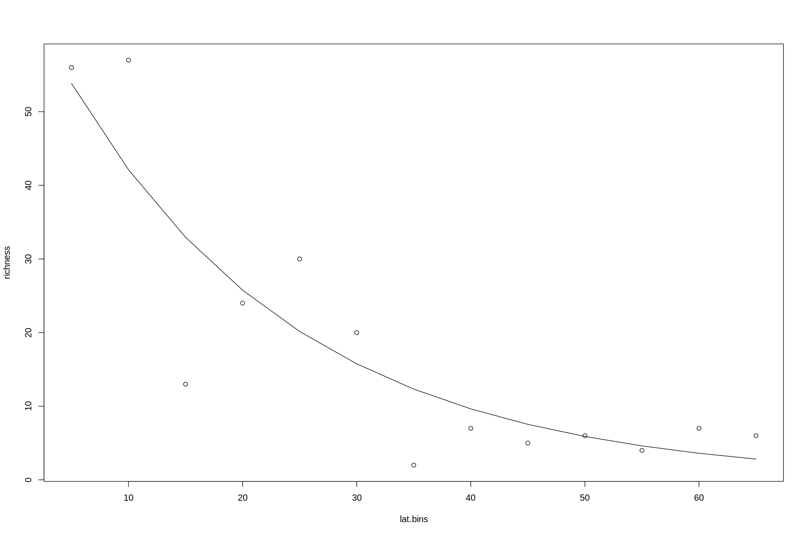
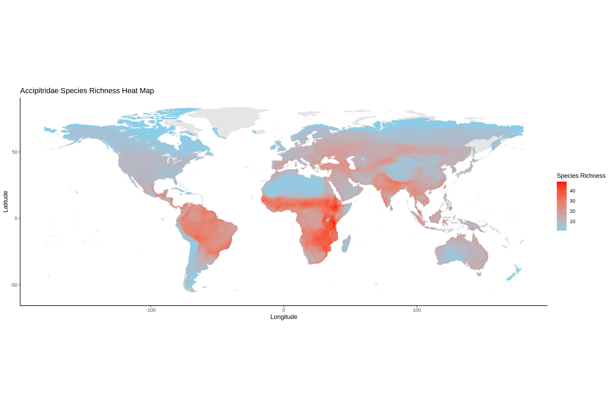

## Macroecology analyses

### 1. Introduction and resources

This practical should be a refresher on linear models in `R`, before introducing you to a phylogentic least squares model, or a PGLS. Because species that are closely related often share similar traits, this means we can't treat them as statistically independent. However, if we look at how the traits are spread throughout the tree, we can 'control' for this non-independance. We'll go into more detail when we run our PGLS. 

### 2. Linear models

For this pratical we'll be working data from the family Anatidae (ducks) to investigate Bergmann’s rule - if there is a relationship between latitude and body mass. 
First, we'll load in the data and inspect it:


```R
# Load the duck latitudinal and bodymass data
duck_data <- read.csv("duck_data.csv",h=T) 

# Check it's been imported
str(duck_data)
head(duck_data)

# Remove any NAs in the data (make sure to check you're not loosing too much data!)
duck_data <- na.omit(duck_data)
```

    'data.frame':	156 obs. of  3 variables:
     $ Jetz_Name: chr  "Dendrocygna viduata" "Dendrocygna autumnalis" "Dendrocygna guttata" "Dendrocygna arborea" ...
     $ Latitude : num  -5.68 -5.68 -3.41 19.66 -0.38 ...
     $ Body_Mass: num  690 755 800 1150 756 ...


<table>
<caption>A data.frame: 6 × 3</caption>
<thead>
	<tr><th></th><th scope=col>Jetz_Name</th><th scope=col>Latitude</th><th scope=col>Body_Mass</th></tr>
	<tr><th></th><th scope=col>&lt;chr&gt;</th><th scope=col>&lt;dbl&gt;</th><th scope=col>&lt;dbl&gt;</th></tr>
</thead>
<tbody>
	<tr><th scope=row>1</th><td>Dendrocygna viduata   </td><td> -5.68</td><td> 689.99</td></tr>
	<tr><th scope=row>2</th><td>Dendrocygna autumnalis</td><td> -5.68</td><td> 755.30</td></tr>
	<tr><th scope=row>3</th><td>Dendrocygna guttata   </td><td> -3.41</td><td> 800.00</td></tr>
	<tr><th scope=row>4</th><td>Dendrocygna arborea   </td><td> 19.66</td><td>1150.00</td></tr>
	<tr><th scope=row>5</th><td>Dendrocygna bicolor   </td><td> -0.38</td><td> 756.37</td></tr>
	<tr><th scope=row>6</th><td>Dendrocygna eytoni    </td><td>-21.27</td><td> 789.99</td></tr>
</tbody>
</table>


The midpoint latitude is the center of the distribution of each species. Because we're interested in the distance from equator, we'll use the `abs()` function to convert our data.


```R
duck_data$abs_latitude <- abs(duck_data$Latitude)
```

We'll start by looking at the relationship between body mass and latitude using a scatterplot.


```R
plot(Body_Mass ~ abs_latitude, data = duck_data)
```


Now there doesn't seem to be much of a relationship at all from our plot. However, to double check we should look at the spread of data for both variables. In particular, body mass is often logarithmically distributed, with lots of small species and fewer large ones. Therefore we might not be seeing the true relationship! 


```R
# We'll use a histogram to look at the spread.
hist(duck_data$Body_Mass)
```


As we suspected! The histogram suggests a log-normal distribution. If we take logs we might see a more normal distribution.


```R
duck_data$log_BM <- log(duck_data$Body_Mass)
hist(duck_data$log_BM)
```


Now we've got some data that resembles a more normal distribution! We'll now look at the spread of latitude.


```R
hist(duck_data$abs_latitude)
```


Not great, but no obvious signs of left or right skews in the data, so we can work with it. We'll leave it as it is.
Let's look at the new relationship between the two variables:


```R
plot(log_BM ~ abs_latitude, data = duck_data)
```


Now we're starting to see some kind of relationship! There's a lot of spread to the points, but we can see the smallest species at the lowest latitudes, and the largest at the highest. To really find out if there's a relationship we can test our hypothesis with a linear model. 


```R
# Run a basic linear model. We separate our dependant variables from predictors using a tilda ~
duck_model <- lm(log_BM ~ abs_latitude, data = duck_data)

# Inspect our linear model
summary(duck_model)
```


    
    Call:
    lm(formula = log_BM ~ abs_latitude, data = duck_data)
    
    Residuals:
        Min      1Q  Median      3Q     Max 
    -1.3202 -0.5291 -0.0613  0.3249  2.1978 
    
    Coefficients:
                 Estimate Std. Error t value Pr(>|t|)    
    (Intercept)  6.505760   0.124237  52.366  < 2e-16 ***
    abs_latitude 0.011639   0.002933   3.969 0.000112 ***
    ---
    Signif. codes:  0 ‘***’ 0.001 ‘**’ 0.01 ‘*’ 0.05 ‘.’ 0.1 ‘ ’ 1
    
    Residual standard error: 0.725 on 150 degrees of freedom
    Multiple R-squared:  0.09503,	Adjusted R-squared:  0.089 
    F-statistic: 15.75 on 1 and 150 DF,  p-value: 0.0001117


Now we can investigate if there is a relationship. There's quite a lot going on with our output, but for this practical we'll focus on just a few main things:

`Coefficients`: This tells us about our predictors in the model. In this one there's 2, the intercept, and latitude.  We'll break each section down further.

`Estimate`: This tells us what mean values of our coefficients should have. For the intercept this will be the point that crosses the y axis. For latitude, this will be the gradient of the relationship between latitude and body mass. 

`Std. Error`: This shows how much faith we have in our estimates. We're fairly certain that our estimates will fall within the range: Estimate +- Standard Error. 

`t value`: This is our test statistic. In a linear model we're testing if each of our estimated values are significantly different from zero. If the Estimate +- (2 x Standard Errors) doesn't overlap zero, it normally means they are significant.

`Pr(>|t|)`: This is our p values for each predictor. This is calculated by weighing up the degrees of freedom against our test statistic, and tells us what the chance is that we observed the same pattern in our data given that there was no relationship, i.e. the null hypothesis is true. 

`Multiple R-squared`: This tells us how much of the variation in our response variable is explained by our model. Large values are better, but often in macro-evolution we see smaller values. Because traits at a macro scale are often driven by multiple selection pressures, which may sometimes be species-specific, we expect less variation to be explained than in smaller more targeted studies. 

`Adjusted R squared`: This also tells us the varition explained in response, but penalises us for including more predictors. This reduces the chances of over-fitting models with lots of predictors that don't contribute much. This is the R-squared that tends to be reported in publications. 

`F Statistc` & `DF` & `p-value`: The last line reports the overall results of our model. When reporting the statistic tests in the results section, we tend to quote these values for the model. This test is comparing our model line against a flat horizontal line at the mean body mass. Simply put, does our latitude model explain more of the variance in body mass than the mean. This is easiest to explain with a quick example:


```R
# Create some data
x <- c(12,18,21, 36, 44, 54, 59)
y <- c(2, 4, 7, 11, 12, 14, 15)

# Create a linear model based only on the mean of body mass
mean <- lm(y ~ 1)

# Create a linear model where x predicts y
linear <- lm(y ~ x)

# Create a plot window with one row and two columns
par(mfrow =c (1,2))

# Plot our data for the mean
plot(x,y, xlim = c(0,60), ylim =c(0,15), main = "Mean") 

# Add the line of the linear model based on the mean
abline(mean, col="red")

# Add in lines to show the distance from each point to mean line (the residuals)
segments(x, y, x, predict(mean))

# Do the same to plot our data with the linear model based on x
plot(x,y, xlim = c(0,60), ylim =c(0,15), main = "Linear")  
abline(linear, col="blue")
segments(x, y, x, predict(linear))
```


From the plots we can see that the blue linear model line passes closer to all of our data points than simply using the mean line. The black lines from our data points to the linear model are the residual variation left over once we've accounted for x. This is often referred to as the residuals.

The F statistic in our summary output is testing if there is a siginificant difference between the residuals from using our mean line against using our linear model instead. This is weighed up against the number of degrees of freedom to calculate our p-value. 

Degrees of freedom are often poorly known but are actually quite simple to understand. They are calculated from the number of independent data points in your model, minus the number of predictors. This is to prevent models that over-fit the data. So models with lots of data points have high degrees of freedom which means we need lower F statistic values to be certain of our model. For models with few data points it depends on the number of predictors. If there's few predictors, like in our model, that means that we can accept lower F statistics. We can be more confident in our relationship if we used fewer predictors to describe it. If we use lots of predictors, we can be less certain in our model, because each predictor may explain some of the variation just by chance. Therefore we need a higher F statistic. When you report your models, report both the degrees of freedom and the F statistic alongside your p-value for the whole model. 

Now that we understand a bit more about our summary report, lets look at it again to investigate the relationship between body mass and latitude. 


```R
summary(duck_model)
```


    
    Call:
    lm(formula = log_BM ~ abs_latitude, data = duck_data)
    
    Residuals:
        Min      1Q  Median      3Q     Max 
    -1.3202 -0.5291 -0.0613  0.3249  2.1978 
    
    Coefficients:
                 Estimate Std. Error t value Pr(>|t|)    
    (Intercept)  6.505760   0.124237  52.366  < 2e-16 ***
    abs_latitude 0.011639   0.002933   3.969 0.000112 ***
    ---
    Signif. codes:  0 ‘***’ 0.001 ‘**’ 0.01 ‘*’ 0.05 ‘.’ 0.1 ‘ ’ 1
    
    Residual standard error: 0.725 on 150 degrees of freedom
    Multiple R-squared:  0.09503,	Adjusted R-squared:  0.089 
    F-statistic: 15.75 on 1 and 150 DF,  p-value: 0.0001117


We can see from our model that both the intercept and latitude are significant predictors. That the intercept is significant isn't very interesting. It means at 0 latitude (the equator), body mass is significantly different from zero. Seeing as it's impossible to have a species with zero body mass, this isn't suprising! What's more interesting is latitude. We can see a significant p-value, so there is a relationship between latitude and body mass. As the estimate is postive, we can see that as latitude increases, so does body mass. For every 1 degree of latitude, log(body mass) increases by 0.012, supporting Bergmann’s rule. We can see that by plotting our model line with our data.


```R
plot(log_BM ~ abs_latitude, data = duck_data)
abline(duck_model)
```


Of course, we can see that many data points don't fit this line. If we look at the adjusted R-squared, we can see that our model explains roughly 9% of the variation in body size. Most macroevolutionary studies have low R-squared values, so this is quite high! We could potentially increase this more by including other predictors which influence body size. Have a think about what these predictors could be. 

We can also see from the bottom line of output that our overall model is significant. Because there is only one predictor (except the intercept), this value will be the same as our p-value for body mass.

As we've ran a standard linear model, we should also check our residuals to see if they are normally distributed. This is one of the assumptions of parametric tests, and if not we might consider using a generalised linear model instead. 


```R
# Plot a density curve of the residuals
plot(density(duck_model$residuals))
```


Our residuals look pretty normally distributed. It's normally good enough just to inspect these plots by eye, to check there's no extreme left or right skew to the distribution. 

### 3. Phylogenetic Generalised Least Squares Models

Up until now we have been treating all our species as independant data points. However, technically this isn't true. Each species is related to each other, and some are more closely related than others. We might expect that closely related species in the same genus are more likely to have a similar body mass than species from different genera. We then come to the conclusion that there are more large species at higher latitudes because they all shared one common ancestor, who happened to be a large species. This would suggest that the evolutionary history of ducks is responsible for the patterns of body mass, rather than a true relationship between latitude and body mass. Fortunately, we can test this using phylogenetically-controlled linear models. One of the easiest to use a PGLS. 

First let's load up the packages we need and the phylogenetic tree of ducks.


```R
library(ape)
library(caper)

# Read in the tree
duck_tree <- read.tree("duck_tree.tre")
plot(duck_tree)
```


We now need to attach our body mass data and tree together, and we can do this by creating a comparative data object from the `caper` package.


```R
# We need to change the Jetz names so that they match the tip labels. gsub is another function to swap patterns in strings.
duck_data$Jetz_Name <- gsub(" ", "_", duck_data$Jetz_Name)

# We specify the phylogeny we need, the data, and which column has the tip label names in
duck_comp <- comparative.data(phy = duck_tree, data = duck_data, names.col = "Jetz_Name")
```

We can inspect our comparative data object to check that it's worked. 


```R
# Return the data 
duck_comp$data
```


<table>
<caption>A data.frame: 152 × 4</caption>
<thead>
	<tr><th></th><th scope=col>Latitude</th><th scope=col>Body_Mass</th><th scope=col>abs_latitude</th><th scope=col>log_BM</th></tr>
	<tr><th></th><th scope=col>&lt;dbl&gt;</th><th scope=col>&lt;dbl&gt;</th><th scope=col>&lt;dbl&gt;</th><th scope=col>&lt;dbl&gt;</th></tr>
</thead>
<tbody>
	<tr><th scope=row>Dendrocygna_arborea</th><td> 19.66</td><td> 1150.00</td><td>19.66</td><td>7.047517</td></tr>
	<tr><th scope=row>Dendrocygna_autumnalis</th><td> -5.68</td><td>  755.30</td><td> 5.68</td><td>6.627115</td></tr>
	<tr><th scope=row>Dendrocygna_arcuata</th><td> -7.97</td><td>  796.18</td><td> 7.97</td><td>6.679825</td></tr>
	<tr><th scope=row>Dendrocygna_javanica</th><td> 18.86</td><td>  519.61</td><td>18.86</td><td>6.253079</td></tr>
	<tr><th scope=row>Dendrocygna_eytoni</th><td>-21.27</td><td>  789.99</td><td>21.27</td><td>6.672020</td></tr>
	<tr><th scope=row>Dendrocygna_guttata</th><td> -3.41</td><td>  800.00</td><td> 3.41</td><td>6.684612</td></tr>
	<tr><th scope=row>Dendrocygna_bicolor</th><td> -0.38</td><td>  756.37</td><td> 0.38</td><td>6.628531</td></tr>
	<tr><th scope=row>Dendrocygna_viduata</th><td> -5.68</td><td>  689.99</td><td> 5.68</td><td>6.536677</td></tr>
	<tr><th scope=row>Thalassornis_leuconotus</th><td> -7.97</td><td>  698.33</td><td> 7.97</td><td>6.548692</td></tr>
	<tr><th scope=row>Cygnus_columbianus</th><td> 67.98</td><td> 6377.96</td><td>67.98</td><td>8.760604</td></tr>
	<tr><th scope=row>Cygnus_buccinator</th><td> 56.68</td><td>11071.13</td><td>56.68</td><td>9.312096</td></tr>
	<tr><th scope=row>Cygnus_cygnus</th><td> 59.51</td><td> 9349.99</td><td>59.51</td><td>9.143131</td></tr>
	<tr><th scope=row>Cygnus_olor</th><td> 49.21</td><td>10682.04</td><td>49.21</td><td>9.276319</td></tr>
	<tr><th scope=row>Cygnus_atratus</th><td>-27.91</td><td> 5623.16</td><td>27.91</td><td>8.634649</td></tr>
	<tr><th scope=row>Cygnus_melancoryphus</th><td>-38.75</td><td> 4711.68</td><td>38.75</td><td>8.457800</td></tr>
	<tr><th scope=row>Chen_canagica</th><td> 66.06</td><td> 2136.49</td><td>66.06</td><td>7.666920</td></tr>
	<tr><th scope=row>Chen_caerulescens</th><td> 70.07</td><td> 2636.15</td><td>70.07</td><td>7.877075</td></tr>
	<tr><th scope=row>Chen_rossii</th><td> 62.61</td><td> 1635.99</td><td>62.61</td><td>7.400003</td></tr>
	<tr><th scope=row>Anser_indicus</th><td> 38.75</td><td> 2212.55</td><td>38.75</td><td>7.701901</td></tr>
	<tr><th scope=row>Anser_erythropus</th><td> 67.98</td><td> 1755.50</td><td>67.98</td><td>7.470509</td></tr>
	<tr><th scope=row>Anser_brachyrhynchus</th><td> 66.06</td><td> 2642.04</td><td>66.06</td><td>7.879307</td></tr>
	<tr><th scope=row>Anser_cygnoides</th><td> 49.21</td><td> 3511.94</td><td>49.21</td><td>8.163924</td></tr>
	<tr><th scope=row>Anser_anser</th><td> 50.37</td><td> 3302.41</td><td>50.37</td><td>8.102408</td></tr>
	<tr><th scope=row>Anser_fabalis</th><td> 61.02</td><td> 2754.73</td><td>61.02</td><td>7.921075</td></tr>
	<tr><th scope=row>Anser_albifrons</th><td> 67.98</td><td> 2506.39</td><td>67.98</td><td>7.826599</td></tr>
	<tr><th scope=row>Branta_leucopsis</th><td> 64.28</td><td> 1683.97</td><td>64.28</td><td>7.428909</td></tr>
	<tr><th scope=row>Branta_sandvicensis</th><td> 20.06</td><td> 2044.12</td><td>20.06</td><td>7.622723</td></tr>
	<tr><th scope=row>Branta_canadensis</th><td> 52.78</td><td> 2811.68</td><td>52.78</td><td>7.941537</td></tr>
	<tr><th scope=row>Branta_ruficollis</th><td> 70.07</td><td> 1226.47</td><td>70.07</td><td>7.111895</td></tr>
	<tr><th scope=row>Branta_bernicla</th><td> 70.07</td><td> 1277.91</td><td>70.07</td><td>7.152981</td></tr>
	<tr><th scope=row>⋮</th><td>⋮</td><td>⋮</td><td>⋮</td><td>⋮</td></tr>
	<tr><th scope=row>Anas_versicolor</th><td>-35.91</td><td> 595.21</td><td>35.91</td><td>6.388914</td></tr>
	<tr><th scope=row>Anas_platalea</th><td>-34.99</td><td> 465.43</td><td>34.99</td><td>6.142962</td></tr>
	<tr><th scope=row>Anas_clypeata</th><td> 54.04</td><td> 612.56</td><td>54.04</td><td>6.417647</td></tr>
	<tr><th scope=row>Anas_rhynchotis</th><td>-30.51</td><td> 638.96</td><td>30.51</td><td>6.459842</td></tr>
	<tr><th scope=row>Anas_smithii</th><td>-24.55</td><td> 591.46</td><td>24.55</td><td>6.382594</td></tr>
	<tr><th scope=row>Anas_discors</th><td> 46.96</td><td> 359.44</td><td>46.96</td><td>5.884547</td></tr>
	<tr><th scope=row>Anas_cyanoptera</th><td> 20.46</td><td> 377.45</td><td>20.46</td><td>5.933438</td></tr>
	<tr><th scope=row>Anas_querquedula</th><td> 51.56</td><td> 325.60</td><td>51.56</td><td>5.785670</td></tr>
	<tr><th scope=row>Anas_hottentota</th><td>-12.58</td><td> 276.36</td><td>12.58</td><td>5.621704</td></tr>
	<tr><th scope=row>Anas_formosa</th><td> 62.61</td><td> 433.98</td><td>62.61</td><td>6.072998</td></tr>
	<tr><th scope=row>Anas_wyvilliana</th><td> 21.27</td><td> 843.42</td><td>21.27</td><td>6.737465</td></tr>
	<tr><th scope=row>Tachyeres_leucocephalus</th><td>-43.75</td><td>3013.00</td><td>43.75</td><td>8.010692</td></tr>
	<tr><th scope=row>Tachyeres_patachonicus</th><td>-45.87</td><td>2821.55</td><td>45.87</td><td>7.945042</td></tr>
	<tr><th scope=row>Tachyeres_brachypterus</th><td>-51.56</td><td>3450.00</td><td>51.56</td><td>8.146130</td></tr>
	<tr><th scope=row>Tachyeres_pteneres</th><td>-51.56</td><td>4737.59</td><td>51.56</td><td>8.463284</td></tr>
	<tr><th scope=row>Lophonetta_specularioides</th><td>-32.27</td><td>1019.93</td><td>32.27</td><td>6.927489</td></tr>
	<tr><th scope=row>Speculanas_specularis</th><td>-45.87</td><td>1496.07</td><td>45.87</td><td>7.310597</td></tr>
	<tr><th scope=row>Amazonetta_brasiliensis</th><td>-13.35</td><td> 499.99</td><td>13.35</td><td>6.214588</td></tr>
	<tr><th scope=row>Oxyura_australis</th><td>-32.27</td><td> 798.00</td><td>32.27</td><td>6.682109</td></tr>
	<tr><th scope=row>Oxyura_leucocephala</th><td> 46.96</td><td> 661.09</td><td>46.96</td><td>6.493890</td></tr>
	<tr><th scope=row>Oxyura_maccoa</th><td>-18.86</td><td> 674.00</td><td>18.86</td><td>6.513230</td></tr>
	<tr><th scope=row>Oxyura_jamaicensis</th><td> 40.71</td><td> 608.15</td><td>40.71</td><td>6.410422</td></tr>
	<tr><th scope=row>Oxyura_vittata</th><td>-35.91</td><td> 642.68</td><td>35.91</td><td>6.465647</td></tr>
	<tr><th scope=row>Plectropterus_gambensis</th><td>  1.13</td><td>3869.00</td><td> 1.13</td><td>8.260751</td></tr>
	<tr><th scope=row>Nomonyx_dominicus</th><td> -8.73</td><td> 364.97</td><td> 8.73</td><td>5.899815</td></tr>
	<tr><th scope=row>Nettapus_auritus</th><td>  1.13</td><td> 266.00</td><td> 1.13</td><td>5.583496</td></tr>
	<tr><th scope=row>Nettapus_coromandelianus</th><td> 19.66</td><td> 391.33</td><td>19.66</td><td>5.969551</td></tr>
	<tr><th scope=row>Nettapus_pulchellus</th><td>-16.48</td><td> 306.98</td><td>16.48</td><td>5.726783</td></tr>
	<tr><th scope=row>Heteronetta_atricapilla</th><td>-32.27</td><td> 538.37</td><td>32.27</td><td>6.288546</td></tr>
	<tr><th scope=row>Stictonetta_naevosa</th><td>-30.51</td><td> 903.27</td><td>30.51</td><td>6.806022</td></tr>
</tbody>
</table>


```R
# Plot the phylogeny
plot(duck_comp$phy)
```


So we can see that our comparative object has worked as it should. Now we can run a pgls to see if information on the phylogeny makes any difference.


```R
duck_pgls <- pgls(log_BM ~ abs_latitude, data = duck_comp, lambda = "ML")
```

The code for a pgls looks largely the same. The only difference is that we have a third arguement, which is the lambda value. The lambda value tells us how randomly body mass and latitude are spread throughout the tree. By saying `"ML"` we've asked the function to calculate lambda using maximum likelihood methods, rather than give it an exact value. 

Let's take a look at the results of the pgls.


```R
summary(duck_pgls)
```


    
    Call:
    pgls(formula = log_BM ~ abs_latitude, data = duck_comp, lambda = "ML")
    
    Residuals:
         Min       1Q   Median       3Q      Max 
    -0.97464 -0.13915 -0.00982  0.12795  0.56476 
    
    Branch length transformations:
    
    kappa  [Fix]  : 1.000
    lambda [ ML]  : 0.983
       lower bound : 0.000, p = < 2.22e-16
       upper bound : 1.000, p = < 2.22e-16
       95.0% CI   : (0.959, 0.993)
    delta  [Fix]  : 1.000
    
    Coefficients:
                  Estimate Std. Error t value Pr(>|t|)    
    (Intercept)  6.7827025  0.7205697  9.4130   <2e-16 ***
    abs_latitude 0.0026244  0.0019744  1.3292   0.1858    
    ---
    Signif. codes:  0 ‘***’ 0.001 ‘**’ 0.01 ‘*’ 0.05 ‘.’ 0.1 ‘ ’ 1
    
    Residual standard error: 0.2301 on 150 degrees of freedom
    Multiple R-squared: 0.01164,	Adjusted R-squared: 0.005052 
    F-statistic: 1.767 on 1 and 150 DF,  p-value: 0.1858 


The output of the summary look largely the same as our linear model. The key difference is we now have information on the branch length transformations, which shows how our trait is influenced by phylogeny. We can also see that our p-value for latitude is now much higher, and above the 0.05 threshold. When we look at our estimate, we can see that it's a postive value, so the same relationship is there, but we can no longer be confident enough to reject our null hypothesis. This is why for macro-evolutionary studies, we always have to include information on the phylogeny!

We should take a second to look at the lambda value. Ours is 0.98 according to the pgls summary. But what does it mean?

Lambda is scaled between 0 and 1, and it's easiest to think of it as how much our trait is bunched up in the tree. Values closer to zero suggest that body mass would be spread randomly among the tree, and the phylogeny does not matter. Values closer to one suggest that body mass is organised strongly throughout the tree, with closer species having more similar sizes.

For an excellent explanation of lambda values, check out this paper by Natalie Cooper at the Natural History Museum, who helped write the second practical on this course.

https://royalsocietypublishing.org/doi/full/10.1098/rstb.2012.0341

What the lambda value actually does is change the length of the branches on the tree, to reflect how body mass is related between species. We can visualise this by plotting trees with different lambda values.


```R
# Load the package geiger that has the rescale function. You'll have to install it if you're in Rstudio on your own laptops.
library(geiger)

# We'll create six trees with different lambda values 
lambda_1_tree <- rescale(duck_tree, "lambda", 1)
lambda_0.8_tree <- rescale(duck_tree, "lambda", 0.8)
lambda_0.6_tree <- rescale(duck_tree, "lambda", 0.6)
lambda_0.4_tree <- rescale(duck_tree, "lambda", 0.4)
lambda_0.2_tree <- rescale(duck_tree, "lambda", 0.2)
lambda_0_tree <- rescale(duck_tree, "lambda", 0)

# Now we'll plot them alongside each other to see the difference

# Change the number of plots and resize the window
par(mfrow = c(2,3))
options(repr.plot.width=15, repr.plot.height=15)

plot(lambda_1_tree, show.tip.label = FALSE, direction = "downwards", main = "1.0")
plot(lambda_0.8_tree, show.tip.label = FALSE, direction = "downwards", main = "0.8")
plot(lambda_0.6_tree, show.tip.label = FALSE, direction = "downwards", main = "0.6")
plot(lambda_0.4_tree, show.tip.label = FALSE, direction = "downwards", main = "0.4")
plot(lambda_0.2_tree, show.tip.label = FALSE, direction = "downwards", main = "0.2")
plot(lambda_0_tree, show.tip.label = FALSE, direction = "downwards", main = "0.0")
```


What's actually happening is the lambda value shortens all the interal branches (everything except the tips). This reduces the difference between species. In the last plot we can see a lambda value of zero, and all the branches are equally close to the root, and therefore to each other. This means that all our species are now independent points, and if we ran a pgls we would get similar results to a linear model. Try it out running a pgls with different lambda values and see what happens!

We can plot the profile of the lambda value from our pgls and see how we came to this number.


```R
# Get the potential values of lambda
lambda_likelihood <- pgls.profile(duck_pgls, which = "lambda")

# Plot them
plot(lambda_likelihood)
```


On the horizontal axis we can see potential lambda values, and on the vertical is how likely they are. Red lines show the 95% confidence intervals. This shows that we are fairly confident in our lambda value. It's always worth plotting the our lambda profile, as a flatter line would mean we're less confident in our lambda, and might not have controlled for our phylogeny properly. Also be wary of smaller phylogenies, as the lambda value is harder to estimate. Try and pick a group with more than 100 species for your coursework just to be safe. 

Don't worry if you struggled to understand any of this! Lambda values can be tricky to get your head around. At this stage, it's only important to be aware that a pgls uses a lambda value to decide how much to weight up the importance of the phylogeny. 

For more information on using a pgls check out this very useful papers that are aimed at beginners. In particular chapeter 6 which you find on researchgate: 

http://www.mpcm-evolution.com/book-sections/part-introduction/5-primer-phylogenetic-generalised-least-squares 

http://www.mpcm-evolution.com/book-sections/part-introduction/6-statistical-issues-assumptions-phylogenetic-generalised-least-squares

https://onlinelibrary.wiley.com/doi/full/10.1111/j.1420-9101.2009.01757.x

### 4. Rapport's Rule

For your coursework you might choose to investigate Rapport's rule, does range size increase with latitude. To do this we're going to use some of the mapping skills that we learnt from Practical 1 to extract range size and latitude. For this example we'll use the family Accipitridae, which includes some birds of prey.

First we'll load in our data. This will be the same data available for your coursework:


```R
trait_data <- read.csv("coursework_trait_data.csv")
str(trait_data)
head(trait_data)
```

    'data.frame':	9872 obs. of  8 variables:
     $ Birdlife_Name       : chr  "Abeillia abeillei" "Abroscopus albogularis" "Abroscopus schisticeps" "Abroscopus superciliaris" ...
     $ Birdlife_common.name: chr  "Emerald-chinned Hummingbird" "Rufous-faced Warbler" "Black-faced Warbler" "Yellow-bellied Warbler" ...
     $ Jetz_Name           : chr  "Abeillia_abeillei" "Abroscopus_albogularis" "Abroscopus_schisticeps" "Abroscopus_superciliaris" ...
     $ Jetz_order          : chr  "Apodiformes" "Passeriformes" "Passeriformes" "Passeriformes" ...
     $ Jetz_family         : chr  "Trochilidae" "Cettidae" "Cettidae" "Cettidae" ...
     $ Body_mass           : num  2.7 4.84 4.7 6.48 1405.08 ...
     $ Beak                : num  13.34 9.88 9.42 12.16 37.03 ...
     $ Redlist_cat         : chr  "LC" "LC" "LC" "LC" ...


<table>
<caption>A data.frame: 6 × 8</caption>
<thead>
	<tr><th></th><th scope=col>Birdlife_Name</th><th scope=col>Birdlife_common.name</th><th scope=col>Jetz_Name</th><th scope=col>Jetz_order</th><th scope=col>Jetz_family</th><th scope=col>Body_mass</th><th scope=col>Beak</th><th scope=col>Redlist_cat</th></tr>
	<tr><th></th><th scope=col>&lt;chr&gt;</th><th scope=col>&lt;chr&gt;</th><th scope=col>&lt;chr&gt;</th><th scope=col>&lt;chr&gt;</th><th scope=col>&lt;chr&gt;</th><th scope=col>&lt;dbl&gt;</th><th scope=col>&lt;dbl&gt;</th><th scope=col>&lt;chr&gt;</th></tr>
</thead>
<tbody>
	<tr><th scope=row>1</th><td>Abeillia abeillei       </td><td>Emerald-chinned Hummingbird</td><td>Abeillia_abeillei       </td><td>Apodiformes  </td><td>Trochilidae </td><td>   2.70</td><td>13.338358</td><td>LC</td></tr>
	<tr><th scope=row>2</th><td>Abroscopus albogularis  </td><td>Rufous-faced Warbler       </td><td>Abroscopus_albogularis  </td><td>Passeriformes</td><td>Cettidae    </td><td>   4.84</td><td> 9.878526</td><td>LC</td></tr>
	<tr><th scope=row>3</th><td>Abroscopus schisticeps  </td><td>Black-faced Warbler        </td><td>Abroscopus_schisticeps  </td><td>Passeriformes</td><td>Cettidae    </td><td>   4.70</td><td> 9.419303</td><td>LC</td></tr>
	<tr><th scope=row>4</th><td>Abroscopus superciliaris</td><td>Yellow-bellied Warbler     </td><td>Abroscopus_superciliaris</td><td>Passeriformes</td><td>Cettidae    </td><td>   6.48</td><td>12.157208</td><td>LC</td></tr>
	<tr><th scope=row>5</th><td>Aburria aburri          </td><td>Wattled Guan               </td><td>Aburria_aburri          </td><td>Galliformes  </td><td>Cracidae    </td><td>1405.08</td><td>37.027875</td><td>NT</td></tr>
	<tr><th scope=row>6</th><td>Acanthagenys rufogularis</td><td>Spiny-cheeked Honeyeater   </td><td>Acanthagenys_rufogularis</td><td>Passeriformes</td><td>Meliphagidae</td><td>  47.80</td><td>24.232124</td><td>LC</td></tr>
</tbody>
</table>


So we can see the data is a near complete species list for the world's birds, with some information on body mass, beak sizes and IUCN categories. We've included two different taxonomies, Birdlife and Jetz, because range maps were available from Birdlife, but our phylogeny uses the Jetz tree.

For more info on the tree, and where download your own in the future, look here:

http://birdtree.org/

So we'll first filter our traits based on the Jetz families.


```R
library(dplyr)
Accip_data <- trait_data %>% filter(Jetz_family == "Accipitridae")
nrow(Accip_data)
```

    
    Attaching package: ‘dplyr’
    
    
    The following object is masked from ‘package:MASS’:
    
        select
    
    
    The following objects are masked from ‘package:stats’:
    
        filter, lag
    
    
    The following objects are masked from ‘package:base’:
    
        intersect, setdiff, setequal, union
    
    


237


Now we need to load in our range data. For convinence we've saved the range data as an `.Rdata` object, which `R` can load back into the working environment. `.Rdata` objects can be extremely useful, especially when you've ran a model that's taken a long time, and wish to save the result without converting it to a specific file format. The maps for each family are available as a separate `R.data` file on blackboard.


```R
# First load in the spatial packages we'll need
library(raster)
library(rgdal)
library(sf)
library(geosphere)


# Load the data into our environment
load("Accipitridae_maps.Rdata")

# Inspect the maps
class(Accip_maps)
head(Accip_maps)
```

    
    Attaching package: ‘raster’
    
    
    The following object is masked from ‘package:dplyr’:
    
        select
    
    
    The following object is masked from ‘package:tidyr’:
    
        extract
    
    
    The following object is masked from ‘package:geiger’:
    
        hdr
    
    
    The following objects are masked from ‘package:MASS’:
    
        area, select
    
    
    The following objects are masked from ‘package:ape’:
    
        rotate, zoom
    
    
    rgdal: version: 1.5-18, (SVN revision 1082)
    Geospatial Data Abstraction Library extensions to R successfully loaded
    Loaded GDAL runtime: GDAL 2.2.3, released 2017/11/20
    Path to GDAL shared files: /usr/share/gdal/2.2
    GDAL binary built with GEOS: TRUE 
    Loaded PROJ runtime: Rel. 4.9.3, 15 August 2016, [PJ_VERSION: 493]
    Path to PROJ shared files: (autodetected)
    Linking to sp version:1.4-4
    


<style>
.list-inline {list-style: none; margin:0; padding: 0}
.list-inline>li {display: inline-block}
.list-inline>li:not(:last-child)::after {content: "\00b7"; padding: 0 .5ex}
</style>
<ol class="list-inline"><li>'sf'</li><li>'data.frame'</li></ol>


<table>
<caption>A sf: 6 × 18</caption>
<thead>
	<tr><th></th><th scope=col>SISID</th><th scope=col>SCINAME</th><th scope=col>DATE_</th><th scope=col>SOURCE</th><th scope=col>PRESENCE</th><th scope=col>ORIGIN</th><th scope=col>SEASONAL</th><th scope=col>DATA_SENS</th><th scope=col>SENS_COMM</th><th scope=col>COMPILER</th><th scope=col>TAX_COM</th><th scope=col>DIST_COM</th><th scope=col>REVIEWERS</th><th scope=col>CITATION</th><th scope=col>VERSION</th><th scope=col>Shape_Length</th><th scope=col>Shape_Area</th><th scope=col>Shape</th></tr>
	<tr><th></th><th scope=col>&lt;int&gt;</th><th scope=col>&lt;chr&gt;</th><th scope=col>&lt;chr&gt;</th><th scope=col>&lt;chr&gt;</th><th scope=col>&lt;int&gt;</th><th scope=col>&lt;int&gt;</th><th scope=col>&lt;int&gt;</th><th scope=col>&lt;chr&gt;</th><th scope=col>&lt;chr&gt;</th><th scope=col>&lt;chr&gt;</th><th scope=col>&lt;chr&gt;</th><th scope=col>&lt;chr&gt;</th><th scope=col>&lt;chr&gt;</th><th scope=col>&lt;chr&gt;</th><th scope=col>&lt;chr&gt;</th><th scope=col>&lt;dbl&gt;</th><th scope=col>&lt;dbl&gt;</th><th scope=col>&lt;MULTIPOLYGON [m]&gt;</th></tr>
</thead>
<tbody>
	<tr><th scope=row>13027</th><td>22695535</td><td>Accipiter albogularis</td><td>2014</td><td>Doughty, 1999; Fergusson-Lees et al, 2001; del Hoyo et al, 1994; Dutson, 2011                                                                                                 </td><td>1</td><td>1</td><td>1</td><td>0</td><td> </td><td>Rob Martin, Philip Taylor; Joe Taylor (BirdLife International)                    </td><td>                         </td><td> </td><td>             </td><td>BirdLife International and Handbook of the Birds of the World (2019)</td><td>2017.2</td><td> 73.59322</td><td>   3.074696</td><td>MULTIPOLYGON (((167.2819 -9...</td></tr>
	<tr><th scope=row>6</th><td>22695490</td><td><span style=white-space:pre-wrap>Accipiter badius     </span></td><td>2013</td><td><span style=white-space:pre-wrap>Fergusson-Lees &amp; Christie, 2001; del Hoyo et al, 1995; Aye et al, 2012; Rasmussen and Anderton, 2012                                                                          </span></td><td>1</td><td>1</td><td>2</td><td>0</td><td> </td><td><span style=white-space:pre-wrap>Philip Taylor; Joe Taylor (BirdLife International)                                </span></td><td><span style=white-space:pre-wrap>                         </span></td><td> </td><td><span style=white-space:pre-wrap>             </span></td><td>BirdLife International and Handbook of the Birds of the World (2019)</td><td>2017.2</td><td>153.40608</td><td> 165.044781</td><td>MULTIPOLYGON (((68.08551 45...</td></tr>
	<tr><th scope=row>7</th><td>22695490</td><td><span style=white-space:pre-wrap>Accipiter badius     </span></td><td>2019</td><td>MacKinnon and Phillipps, 2000; Fergusson-Lees &amp; Christie, 2001; del Hoyo et al, 1995; Hockey et al, 2005; Jennings, 2010; Porter and Aspinall, 2010; Pedersen 2017; eBird 2019</td><td>1</td><td>1</td><td>1</td><td>0</td><td> </td><td><span style=white-space:pre-wrap>Rob Martin, Philip Taylor; Joe Taylor (BirdLife International)                    </span></td><td><span style=white-space:pre-wrap>                         </span></td><td> </td><td><span style=white-space:pre-wrap>             </span></td><td>BirdLife International and Handbook of the Birds of the World (2019)</td><td>2019.1</td><td>935.61334</td><td>1763.291563</td><td>MULTIPOLYGON (((32.91687 -2...</td></tr>
	<tr><th scope=row>8</th><td>22695490</td><td><span style=white-space:pre-wrap>Accipiter badius     </span></td><td>2013</td><td><span style=white-space:pre-wrap>Fergusson-Lees &amp; Christie, 2001; del Hoyo et al, 1995; Jennings, 2010; Porter and Aspinall, 2010                                                                              </span></td><td>1</td><td>1</td><td>3</td><td>0</td><td> </td><td><span style=white-space:pre-wrap>Philip Taylor; Joe Taylor (BirdLife International)                                </span></td><td><span style=white-space:pre-wrap>                         </span></td><td> </td><td><span style=white-space:pre-wrap>             </span></td><td>BirdLife International and Handbook of the Birds of the World (2019)</td><td>2017.2</td><td> 62.96064</td><td><span style=white-space:pre-wrap>  41.606780</span></td><td>MULTIPOLYGON (((54.46491 17...</td></tr>
	<tr><th scope=row>8572</th><td>22695669</td><td>Accipiter bicolor    </td><td>2006</td><td>Ridgley, 2003; Ferguson-Lees, 2005;Ridgely, 2002                                                                                                                              </td><td>1</td><td>1</td><td>1</td><td>0</td><td> </td><td>WWF-US, 2000; NatureServe, 2002                                                   </td><td>Accipiter bicolor bicolor</td><td> </td><td>Ridgely, 2002</td><td>BirdLife International and Handbook of the Birds of the World (2019)</td><td>2017.2</td><td>906.30544</td><td>1214.095562</td><td>MULTIPOLYGON (((-96.40631 1...</td></tr>
	<tr><th scope=row>16871</th><td>22695605</td><td>Accipiter brachyurus </td><td>2018</td><td><span style=white-space:pre-wrap>Ferguson-Lees &amp; Christie, 2001, 2005; Buchanan et al. 2008                                                                                                                    </span></td><td>1</td><td>1</td><td>1</td><td>0</td><td> </td><td>Richard Johnson (BirdLife International); Hannah Wheatley (BirdLife International)</td><td><span style=white-space:pre-wrap>                         </span></td><td> </td><td><span style=white-space:pre-wrap>             </span></td><td>BirdLife International and Handbook of the Birds of the World (2019)</td><td>2018.1</td><td> 23.70288</td><td><span style=white-space:pre-wrap>   2.903495</span></td><td>MULTIPOLYGON (((152.9669 -4...</td></tr>
</tbody>
</table>


You can see that the range maps are stored in a spatial dataframe, called and `sf` class of object. We have information about ranges stored as text, and the spatial data stored as multiploygons. A polygon is one way that R stores spatial data. It records the coordinates of each corner, which it can use to calculate the full shape. Polygons also all have a coordinate reference system (such as longitude and latitude) which is how R knows where the shapes belong in the world. We can plot the polygons to see what they look like. 


```R
#  Take the range polygon from the first row.
plot(Accip_maps$Shape[1], axes=TRUE)
```


Some species have multiple rows, based on different types of ranges (i.e. breeding range, see (http://datazone.birdlife.org/species/spcdistPOS) for more information). We need to combine different ranges for each species and calculate the range size. 

We can then plot the range sizes to view them at a global scale. For this practical we'll split ranges in small and large, and highlight the smaller ranges on the map. To do this we need to utilise a `for loop` to go through our maps, which may be a new concept for some of you. Don't be put off if it seems complicated! Remember you can query functions using `?` in front of functions like this: `?area`, `?subset`. You can also run each line of a loop one by one to better understand what's happening.


```R
# And lets add columns to our data for storing range and latitude. 
Accip_data$range_size <- NA
Accip_data$latitude <- NA
Accip_data$range_large <- NA

# We want to subset our range maps for only the range maps in which it is present now (not historical).
Accip_maps <- subset(Accip_maps, Accip_maps$PRESENCE %in% c(1,2,3))

# Open a for loop which will cycle through each species in our list of birdlife names. The object 'species' is just a placeholder. We could name it whatever we want, as long as we give R a sensible object to iterate through.
# The curly brackets show the beginning and the end of the loop, which will be repeated for each species.
for (species in Accip_data$Birdlife_Name){

  # We want to subset our range maps for each species, and combine the different ranges (breeding, winter etc.). st_combine combines each range, and as_Spatial converts it into an 'SpatialPolygons' object.
  map_data <- subset(Accip_maps, Accip_maps$SCINAME == species)
  combined_range <- as_Spatial(st_combine(map_data$Shape))

  # Extract the rangesize (area) and the latitude (the y component of the center of the polygon). Divide by 10^6 to convert from m^2 to km^2.
  range <- areaPolygon(combined_range, na.rm = TRUE)/1000000
  latitude <- centroid(combined_range)[2]

  # Calculate if it's small range or a large range. IF functions have a logical expression inside the brackets. If it's TRUE it will run the line between the curly brackets. If it's FALSE, it will run what's after else.
  if (range > 1000000){
    range_size <- 2
  } else {
    range_size <- 1
  }

  # Save our variables in the dataframe, making sure the row matches the birdlife name for each iteration of the loop.
  Accip_data[Accip_data$Birdlife_Name == species, "range_size"] <- range
  Accip_data[Accip_data$Birdlife_Name == species, "latitude"] <- latitude
  Accip_data[Accip_data$Birdlife_Name == species, "range_large"] <- range_size
}
```

Now you've got all the data you'll need to investigate Rapoport's rule. 


> Extra task: Can you use skills from Practical 2 and 3 to run a PGLS to detirmine if Rapoport's rule is true in Accipitridae? You'll need to read in the 'all_birds.tre' and drop the tips for all the other species. You might also have to transform your data, as we did at the beginning of this practical.

To plot the ranges we're going to convert our sf dataframe of polygons into a raster image, similar to the ones in Practical 1. To do this we'll install a new package, called `fasterize`. This package provides an updated version of the function `rasterize()`, but much faster! Both functions take a set of polygons, and transform them into rasters, using a template with the right size and resolution. We can also tell `fasterize` that we want our cells to be based on certain values, such as range_size. 


```R
install.packages("fasterize")
library(fasterize)
```

    Installing package into ‘/usr/local/lib/R/site-library’
    (as ‘lib’ is unspecified)
    


```R
# Combine the two datasets into one object so we have range size info and the polygons together. This turns our sf object into a normal dataframe.
Accip_all <- left_join(Accip_data, Accip_maps, by = c("Birdlife_Name" = "SCINAME"))

# Start by creating an empty raster stack to store our data in.
raster_template <- raster(ncols=2160, nrows = 900, ymn = -60)

# 'fasterize' needs objects to be an sf class so we'll convert it back.
Accip_all <- st_sf(Accip_all)

# Use the fasterize function with the raster template. We want to use the range_large field, and the function min takes the smallest value when they overlap. 
# (So small ranges are shown on top of large ranges)
range_raster <- fasterize(Accip_all, raster_template, field = "range_large", fun = "min")

# Plot the new map.
plot(range_raster, col=rainbow(2))
```


So now we can see where all the small range sizes are relative to the large ones. However, it doesn't look very pretty and countries without any ranges are left off the map. We can make a much clearer map using `ggplot2`. 


```R
library(tidyr)
library(ggplot2)

# Convert the raster into a raster dataframe. This will be coordinates of the raster pixels (cols x and y) and the value of the raster pixels (col index_1). Remove rows with NA values from this dataframe.
raster_data <- as.data.frame(range_raster, xy=TRUE) %>% drop_na()
colnames(raster_data) <- c("long", "lat", "index")

# Add labels for the range sizes so that ggplot colours them as discrete, rather than a continous number.
raster_data$ranges[raster_data$index == 1] <- "Small"
raster_data$ranges[raster_data$index == 2] <- "Large"

# We can then plot this in ggplot. We have to first create the color scheme for our map.
myColors <- c("grey80", "red")

# Assign names to these colors that correspond to each range size.
names(myColors) <- unique(raster_data$ranges)

# Create the color scale.
colScale <- scale_fill_manual(name = "Range Sizes", values = myColors)
```


```R
# Create a plot with ggplot (the plus signs at the end of a line carry over to the next line).
range_plot <- ggplot() +
  # borders imports all the country outlines onto the map. colour changes the color of the outlines, fill changes the color of the insides of the countries
  # this will grey out any terrestrial area which isn't part of a range.
  borders(ylim = c(-60,90), fill = "grey90", colour = "grey90") +
  
  # Borders() xlim is -160/200 to catch the edge of russia. We need to reset the xlim to -180/180 to fit our raster_stack.
  xlim(-180, 180) + 
  
  # Add the range information on top.
  geom_tile(aes(x=long, y=lat, fill= ranges), data=raster_data) +
  # Add colours.
  colScale +
  # Add title.
  ggtitle("Small range sizes in the Accipitidae") + 
  # Add the classic theme (things like gridlines, font etc.)
  theme_classic() +
  # Add axes labels.
  ylab("Latitude") + 
  xlab("Longitude") + 
  # coord_fixed() makes ggplot keep our aspect ratio the same, rather than stretching the plot to fit all available space.
  coord_fixed() 

# Return the plot so we can view it.
options(repr.plot.width=15, repr.plot.height=10)
range_plot
```


That looks much better than the first. Experiment with your own maps to create a map for your report. Try changing how you show ranges, such as what detirmines if a range is large or small, or anything else you can think of! You can save your plots as a file using different formats like a jpeg. Watch out for how the map transforms when it's saved and edit your plots accordingly.


```R
# Open up a new plotting device which will save a photo.
jpeg("my_map.jpeg")

# Add the plot to the plotting device.
range_plot

# Turn off the plotting device to save it.
dev.off()
```


<strong>png:</strong> 2


From this practical you should be able to run a pgls using the data we've generated and a species tree. You'll have to explore your data and potentially transform variables. You should also have all the code to cut down your tree. You can find a tree for all Jetz species on blackboard called "all_birds.tre", or you can download your own from:

http://birdtree.org/

### 5. Latitudinal Diversity Gradient

Another question you might pick for your coursework is to investigate the latitudinal diversity gradient for your chosen taxa. We'll explore the same relationship with Accipitridae. We've already extracted latitude but we for this model we will lump species into bins at 5 degree latitudes and see if some bins are bigger closer to the equator.


```R
# First we need to get absolute latitude.
Accip_data$abs.latitude <- abs(Accip_data$latitude)

# First lets create a bin range (from 0 to 90 which is max latitude) and size (by=5)
range <- seq(0, 90, by=5) 

# Create labels for our bins. We want to skip zero, as the labels refer to the upper limits of each break. 
labels <- seq(5, 90, 5)

# We can now 'cut' up our latitude and put them into bins. This function adds an extra column, and adds a label for which bin each species should be in.
Accip_data$lat.bins <- cut(Accip_data$abs.latitude, breaks=range, labels=labels) 

# The cut function creates the labels as factors, so we'll turn them back into numbers to plot. We turn them into characters first because as.numeric will convert factors into their level order, rather than the value they are.
Accip_data$lat.bins <- as.numeric(as.character(Accip_data$lat.bins))

# Plot our bins as a histogram
hist(Accip_data$lat.bins, breaks = 7) 
```


It definetly looks like a pattern is going on there! We can investigate this using a model. Because the data is count, it looks like it has a poisson distribution. For this reason we might want to utilise a generalised linear model instead. Also because we've binned species, we won't use a pgls for this question. First let's generate species richness.


```R
# Get the frequency of each bin
species_richness <- count(Accip_data, lat.bins)
colnames(species_richness)[2] <- "richness"
species_richness
```


<table>
<caption>A data.frame: 13 × 2</caption>
<thead>
	<tr><th scope=col>lat.bins</th><th scope=col>richness</th></tr>
	<tr><th scope=col>&lt;dbl&gt;</th><th scope=col>&lt;int&gt;</th></tr>
</thead>
<tbody>
	<tr><td> 5</td><td>56</td></tr>
	<tr><td>10</td><td>57</td></tr>
	<tr><td>15</td><td>13</td></tr>
	<tr><td>20</td><td>24</td></tr>
	<tr><td>25</td><td>30</td></tr>
	<tr><td>30</td><td>20</td></tr>
	<tr><td>35</td><td> 2</td></tr>
	<tr><td>40</td><td> 7</td></tr>
	<tr><td>45</td><td> 5</td></tr>
	<tr><td>50</td><td> 6</td></tr>
	<tr><td>55</td><td> 4</td></tr>
	<tr><td>60</td><td> 7</td></tr>
	<tr><td>65</td><td> 6</td></tr>
</tbody>
</table>


Now to run a glm, using a poisson error structure given our data is very skewed.


```R
# The only difference with running a glm is now we have to specify the family as well.
accip_model <- glm(richness ~ lat.bins, data = species_richness, family = "poisson")
summary(accip_model)
```


    
    Call:
    glm(formula = richness ~ lat.bins, family = "poisson", data = species_richness)
    
    Deviance Residuals: 
        Min       1Q   Median       3Q      Max  
    -3.9630  -0.8936   0.0432   1.5809   2.1750  
    
    Coefficients:
                 Estimate Std. Error z value Pr(>|z|)    
    (Intercept)  4.232039   0.109065   38.80   <2e-16 ***
    lat.bins    -0.049159   0.004344  -11.32   <2e-16 ***
    ---
    Signif. codes:  0 ‘***’ 0.001 ‘**’ 0.01 ‘*’ 0.05 ‘.’ 0.1 ‘ ’ 1
    
    (Dispersion parameter for poisson family taken to be 1)
    
        Null deviance: 206.254  on 12  degrees of freedom
    Residual deviance:  46.306  on 11  degrees of freedom
    AIC: 105.87
    
    Number of Fisher Scoring iterations: 5


You should be able to figure out if there's a relationship there! One thing to remember about a glm is that we've applied a link function. For a poisson model this is a log-link function. This means that the relationship between our variables isn't as simple as a 0.05 decrease in species richness with 1 degree of latitude. A log-link function takes a log of the entire right side of the model formula. For interpretation, we first need to back-transform the equation and write out our model as:

$$Richness \sim e^{(4.232\ -\ 0.049\ \times lat.bins)}  $$

Because of the law of exponents, we can simplify it to:

$$Richness \sim \frac{e^{4.232}} {e^{0.049 \times lat.bins}}  $$

The top half of the fraction is the intercept, which simplifies to approximately 69. This is the predicted species richness at the equator. We're more interested in the change with latitude so we can simplify the bottom to get 1.05. Dividing by 1.05 is the same as a decrease of 5%. Therefore, for every increase of 1 degree of latitude, theres a 5% decrease in species richness (starting from the equator at 69). We can see this relationship by plotting our model.


```R
# We first plot raw values as just a scatter plot.
plot(richness ~ lat.bins, data = species_richness)

# And then add a line of the fitted values of the model.
lines(species_richness$lat.bins, accip_model$fitted.values)
```





Don't worry if that seems confusing! It's initially quite hard to understand, but in the plot you can see that there's roughly a 5% decrease in species richness with every 1 degree latitude increase. 

Lastly, you might also want to plot a map of species richness to go alongside your plot. For this we just use the fasterize function again, but this time we leave out the field arguement. This means fasterize will count every range as 1, and will sum them where they overlap to get species richness.


```R
# Use the fasterize function with the raster template, summing species for species richness.
SR_raster <- fasterize(Accip_all, raster_template, fun = "sum")

# Plot the new map.
plot(SR_raster)
```


Again we can make this map nicer!


```R
# Convert the raster into a raster dataframe. This will be coordinates of the raster pixels (cols x and y) and the value of the raster pixels (col index_1). Remove rows with NA values from this dataframe.
raster_data <- as.data.frame(SR_raster, xy=TRUE) %>% drop_na()
colnames(raster_data) <- c("long", "lat", "richness")

# Plot with ggplot.
richness_plot <- ggplot() +
  borders(ylim = c(-60,90), fill = "grey90", colour = "grey90") +
  xlim(-180, 180) + 
  geom_tile(aes(x=long, y=lat, fill= richness), data=raster_data) +
  scale_fill_gradientn(name = "Species Richness", colors = c("skyblue", "red")) +
  ggtitle("Accipitridae Species Richness Heat Map") + 
  theme_classic() +
  ylab("Latitude") + 
  xlab("Longitude") + 
    theme_classic() +
  ylab("Latitude") + 
  xlab("Longitude") + coord_fixed()

# Return the plot so we can view it.
richness_plot
```




