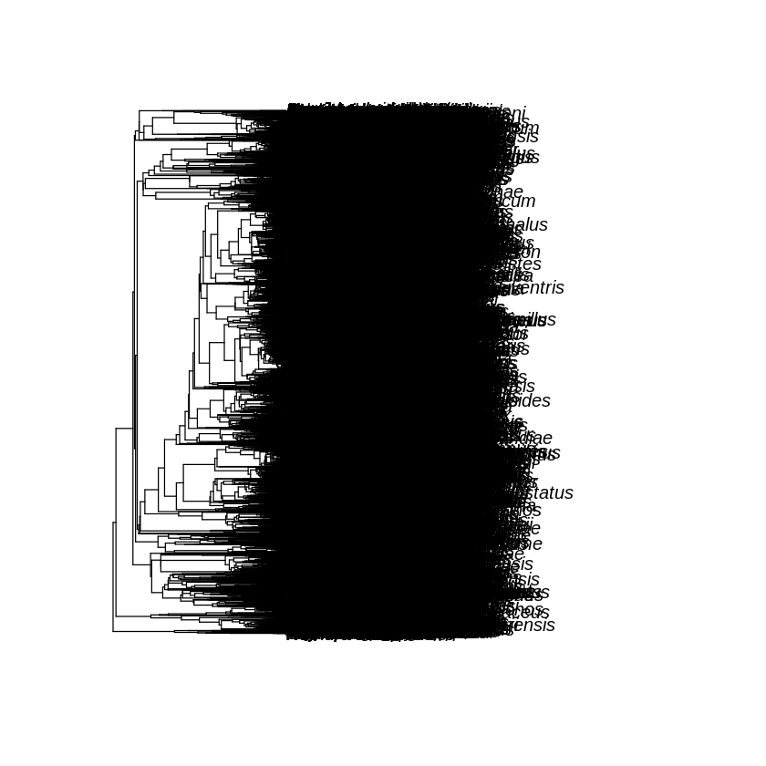
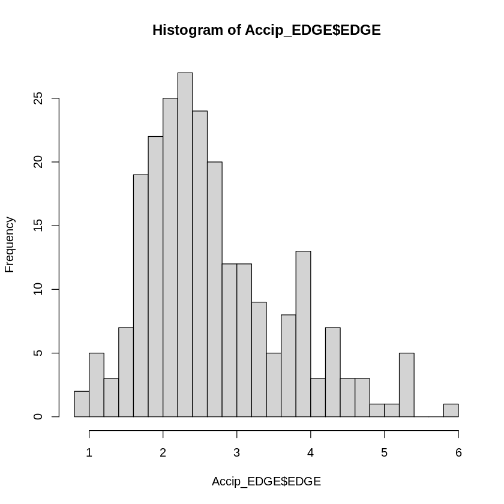
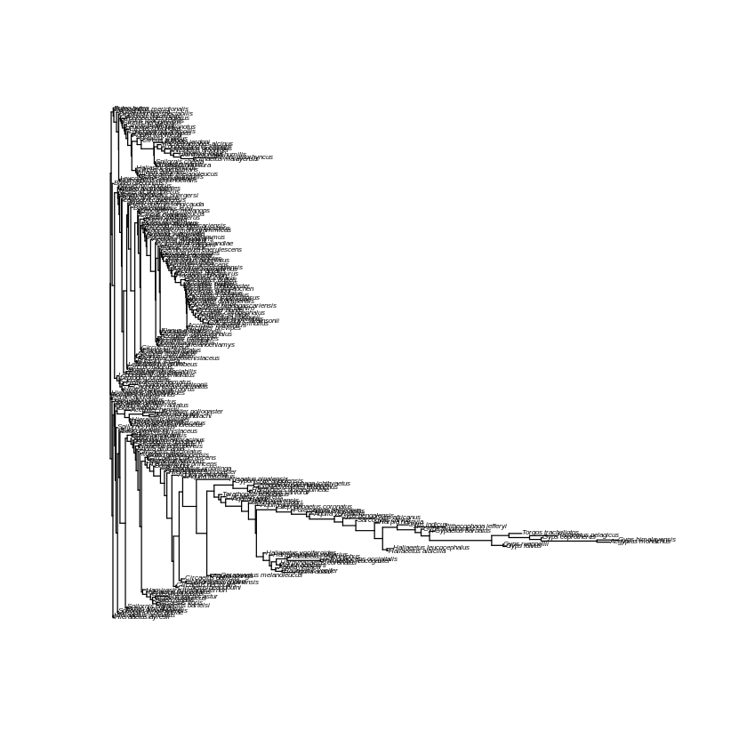
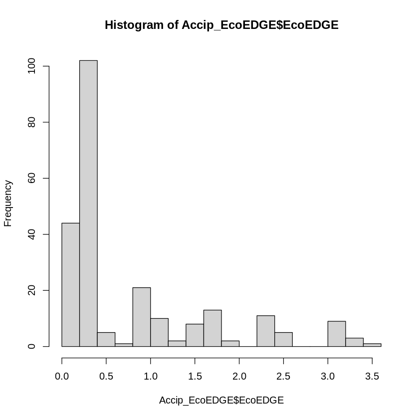
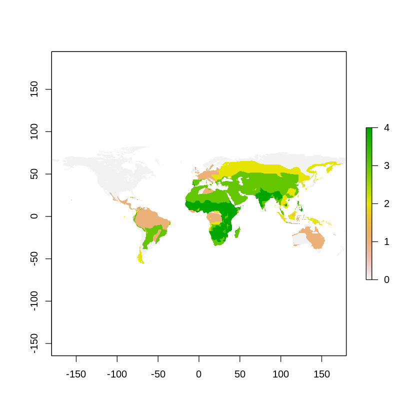
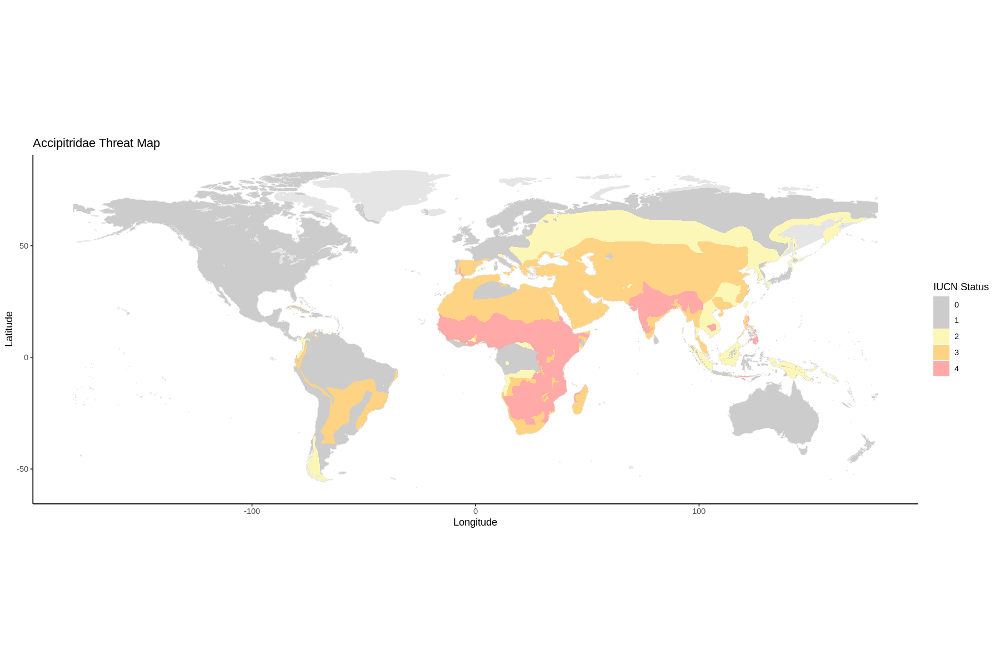

## Setting conservation priorities

### 1. Introduction and resources

This practical is aimed to introduce you to the EDGE & FUDGE Scores that you'll need for your conservation strategy coursework. Put briefly, these scores balance the distinctiveness of species against their risk of extinction to detirmine conservation priorities. You can find out more information about EDGE scores from the ZSL website: 

<https://www.zsl.org/conservation/our-priorities/wildlife-back-from-the-brink/animals-on-the-edge>

We will also try plotting a simple map of IUCN categories so we can visual the risk to our clade across the globe.

### 2. Preparing your Data

To calculate EDGE metrics, we need data on the species we're interested in, and their phylogenetic relationship. For the coursework we're interested in EDGE scores for a specific clade, however it's also common to look at areas such as national parks.

For this practical we're going to use the same family as Practical 3, Accipitridae. We'll use the same table of traits from Practical 3 to import our data and filter it.

```R
trait_data <- read.csv("coursework_trait_data.csv")
str(trait_data)
head(trait_data)
```

    'data.frame': 9872 obs. of  8 variables:
     $ Birdlife_Name       : chr  "Abeillia abeillei" "Abroscopus albogularis" "Abroscopus schisticeps" "Abroscopus superciliaris" ...
     $ Birdlife_common.name: chr  "Emerald-chinned Hummingbird" "Rufous-faced Warbler" "Black-faced Warbler" "Yellow-bellied Warbler" ...
     $ Jetz_Name           : chr  "Abeillia_abeillei" "Abroscopus_albogularis" "Abroscopus_schisticeps" "Abroscopus_superciliaris" ...
     $ Jetz_order          : chr  "Apodiformes" "Passeriformes" "Passeriformes" "Passeriformes" ...
     $ Jetz_family         : chr  "Trochilidae" "Cettidae" "Cettidae" "Cettidae" ...
     $ Body_mass           : num  2.7 4.84 4.7 6.48 1405.08 ...
     $ Beak                : num  13.34 9.88 9.42 12.16 37.03 ...
     $ Redlist_cat         : chr  "LC" "LC" "LC" "LC" ...

<table>
<caption>A data.frame: 6 × 8</caption>
<thead>
	<tr><th></th><th scope=col>Birdlife_Name</th><th scope=col>Birdlife_common.name</th><th scope=col>Jetz_Name</th><th scope=col>Jetz_order</th><th scope=col>Jetz_family</th><th scope=col>Body_mass</th><th scope=col>Beak</th><th scope=col>Redlist_cat</th></tr>
 <tr><th></th><th scope=col>&lt;chr&gt;</th><th scope=col>&lt;chr&gt;</th><th scope=col>&lt;chr&gt;</th><th scope=col>&lt;chr&gt;</th><th scope=col>&lt;chr&gt;</th><th scope=col>&lt;dbl&gt;</th><th scope=col>&lt;dbl&gt;</th><th scope=col>&lt;chr&gt;</th></tr>
</thead>
<tbody>
	<tr><th scope=row>1</th><td>Abeillia abeillei       </td><td>Emerald-chinned Hummingbird</td><td>Abeillia_abeillei       </td><td>Apodiformes  </td><td>Trochilidae </td><td>   2.70</td><td>13.338358</td><td>LC</td></tr>
	<tr><th scope=row>2</th><td>Abroscopus albogularis  </td><td>Rufous-faced Warbler       </td><td>Abroscopus_albogularis  </td><td>Passeriformes</td><td>Cettidae    </td><td>   4.84</td><td> 9.878526</td><td>LC</td></tr>
 <tr><th scope=row>3</th><td>Abroscopus schisticeps  </td><td>Black-faced Warbler        </td><td>Abroscopus_schisticeps  </td><td>Passeriformes</td><td>Cettidae    </td><td>   4.70</td><td> 9.419303</td><td>LC</td></tr>
 <tr><th scope=row>4</th><td>Abroscopus superciliaris</td><td>Yellow-bellied Warbler     </td><td>Abroscopus_superciliaris</td><td>Passeriformes</td><td>Cettidae    </td><td>   6.48</td><td>12.157208</td><td>LC</td></tr>
 <tr><th scope=row>5</th><td>Aburria aburri          </td><td>Wattled Guan               </td><td>Aburria_aburri          </td><td>Galliformes  </td><td>Cracidae    </td><td>1405.08</td><td>37.027875</td><td>NT</td></tr>
 <tr><th scope=row>6</th><td>Acanthagenys rufogularis</td><td>Spiny-cheeked Honeyeater   </td><td>Acanthagenys_rufogularis</td><td>Passeriformes</td><td>Meliphagidae</td><td>  47.80</td><td>24.232124</td><td>LC</td></tr>
</tbody>
</table>

And again filter for Accipitridae.

```R
library(dplyr)
Accip_data <- trait_data %>% filter(Jetz_family == "Accipitridae")
nrow(Accip_data)
```

    
    Attaching package: ‘dplyr’
    
    
    The following objects are masked from ‘package:stats’:
    
        filter, lag
    
    
    The following objects are masked from ‘package:base’:
    
        intersect, setdiff, setequal, union
    

237

Because we're going to use EDGE scores, we should check for any extinct species we need to remove.

```R
# This operator | means OR. EW means extinct in the wild.
Accip_data %>% filter(Redlist_cat == "EX" | Redlist_cat == "EW")
```

<table>
<caption>A data.frame: 0 × 8</caption>
<thead>
 <tr><th scope=col>Birdlife_Name</th><th scope=col>Birdlife_common.name</th><th scope=col>Jetz_Name</th><th scope=col>Jetz_order</th><th scope=col>Jetz_family</th><th scope=col>Body_mass</th><th scope=col>Beak</th><th scope=col>Redlist_cat</th></tr>
 <tr><th scope=col>&lt;chr&gt;</th><th scope=col>&lt;chr&gt;</th><th scope=col>&lt;chr&gt;</th><th scope=col>&lt;chr&gt;</th><th scope=col>&lt;chr&gt;</th><th scope=col>&lt;dbl&gt;</th><th scope=col>&lt;dbl&gt;</th><th scope=col>&lt;chr&gt;</th></tr>
</thead>
<tbody>
</tbody>
</table>

Great, no extinct species in this family! There shouldn't really be many in our Jetz phylogeny, but some do turn up occasionally.

Now we need to load in our tree. For this practical we're using a random tree extracted from http://birdtree.org/

Because we're not sure on the exact placement of some species tips, the Jetz tree has multiple versions, each with a slightly different layout. Normally this only means a few species have swapped places slighly. This is why we've chosen a random tree for our analysis. There are other (better) methods for dealing with this uncertainty, but for these practicals it will be enough to use a random tree. If you're interested in these methods then this is a good paper to check out:

https://academic.oup.com/cz/article/61/6/959/1800551

```R
library(ape)
library(caper)

# Load in and plot the tree
bird_tree <- read.tree("all_birds.tre")
plot(bird_tree)
```

    Loading required package: MASS
    
    
    Attaching package: ‘MASS’
    
    
    The following object is masked from ‘package:dplyr’:
    
        select
    
    
    Loading required package: mvtnorm



### 3. ED Scores

Now that we've got our tree and our species we can start calculating our ED (Evolutionary Distinctiveness) scores. Because we are calculating the evolutionary distinctiveness of Accipitridae, we want to use the whole bird phylogeny to compare against. Then we can find then out if our species in the UK are very closely related to others in the tree, or represent distinct lineages that might want to conserve to protect valuable evolutionary diversity.

We can do this easily using a simple function from the `caper` package. This sometimes takes a while to run.

```R
# We can first transform our tree into a matrix of distances from each tip to tip. This step is optional but stops a warning message from ed.calc, which prefers a matrix to a tree.
bird_matrix <- clade.matrix(bird_tree)

# Now we can run the ed.calc function, which calculates ED scores for each species. The output gives two dataframes, but we only want the species names and scores so we use $spp
ED <- ed.calc(bird_matrix)$spp
head(ED)
```

<table>
<caption>A data.frame: 6 × 2</caption>
<thead>
 <tr><th></th><th scope=col>species</th><th scope=col>ED</th></tr>
 <tr><th></th><th scope=col>&lt;chr&gt;</th><th scope=col>&lt;dbl&gt;</th></tr>
</thead>
<tbody>
 <tr><th scope=row>1</th><td>Nothura_maculosa      </td><td>12.22294</td></tr>
 <tr><th scope=row>2</th><td>Nothura_minor         </td><td>12.22294</td></tr>
 <tr><th scope=row>3</th><td>Nothura_darwinii      </td><td>10.19624</td></tr>
 <tr><th scope=row>4</th><td>Nothura_boraquira     </td><td>10.19624</td></tr>
 <tr><th scope=row>5</th><td>Nothura_chacoensis    </td><td>13.05058</td></tr>
	<tr><th scope=row>6</th><td>Nothoprocta_perdicaria</td><td>15.18505</td></tr>
</tbody>
</table>

Now that we've got our ED scores for each species, we need to log transform and normalise our scores. 

```R
# By adding 1 to our scores, this prevents negative logs when our ED scores are below 1. 
ED$EDlog <- log(1+ED$ED)

# We can normalise our scores so they're scaled between 0 and 1
ED$EDn <- (ED$EDlog - min(ED$EDlog)) / (max(ED$EDlog) - min(ED$EDlog))
head(ED)
```

<table>
<caption>A data.frame: 6 × 4</caption>
<thead>
	<tr><th></th><th scope=col>species</th><th scope=col>ED</th><th scope=col>EDlog</th><th scope=col>EDn</th></tr>
	<tr><th></th><th scope=col>&lt;chr&gt;</th><th scope=col>&lt;dbl&gt;</th><th scope=col>&lt;dbl&gt;</th><th scope=col>&lt;dbl&gt;</th></tr>
</thead>
<tbody>
	<tr><th scope=row>1</th><td>Nothura_maculosa      </td><td>12.22294</td><td>2.581953</td><td>0.5385864</td></tr>
	<tr><th scope=row>2</th><td>Nothura_minor         </td><td>12.22294</td><td>2.581953</td><td>0.5385864</td></tr>
	<tr><th scope=row>3</th><td>Nothura_darwinii      </td><td>10.19624</td><td>2.415578</td><td>0.4955765</td></tr>
	<tr><th scope=row>4</th><td>Nothura_boraquira     </td><td>10.19624</td><td>2.415578</td><td>0.4955765</td></tr>
	<tr><th scope=row>5</th><td>Nothura_chacoensis    </td><td>13.05058</td><td>2.642663</td><td>0.5542808</td></tr>
	<tr><th scope=row>6</th><td>Nothoprocta_perdicaria</td><td>15.18505</td><td>2.784088</td><td>0.5908408</td></tr>
</tbody>
</table>

Now that we have our normalised scores for all birds, we need to subset the list for just Accipitridae.

```R
# Pull out the ED row numbers for our species list.
row_numbers <- (ED$species %in% Accip_data$Jetz_Name)

# Get our UK species with ED scores
Accip_ED <- ED[row_numbers,]
str(Accip_ED)
```

    'data.frame':	237 obs. of  4 variables:
     $ species: chr  "Elanus_caeruleus" "Elanus_axillaris" "Elanus_leucurus" "Elanus_scriptus" ...
     $ ED     : num  18.5 18.5 21.2 21.2 26.8 ...
     $ EDlog  : num  2.97 2.97 3.1 3.1 3.33 ...
     $ EDn    : num  0.638 0.638 0.672 0.672 0.731 ...

We now have the ED scores of 237 species in Accipitridae. With these scores we can see how unique our species are in terms of the evolutionary pathway.

```R
# Find the highest ED score
Accip_ED[Accip_ED$EDn == max(Accip_ED$EDn),]
```

<table>
<caption>A data.frame: 2 × 4</caption>
<thead>
	<tr><th></th><th scope=col>species</th><th scope=col>ED</th><th scope=col>EDlog</th><th scope=col>EDn</th></tr>
	<tr><th></th><th scope=col>&lt;chr&gt;</th><th scope=col>&lt;dbl&gt;</th><th scope=col>&lt;dbl&gt;</th><th scope=col>&lt;dbl&gt;</th></tr>
</thead>
<tbody>
	<tr><th scope=row>8513</th><td>Chelictinia_riocourii</td><td>26.82268</td><td>3.325852</td><td>0.7308933</td></tr>
	<tr><th scope=row>8514</th><td>Gampsonyx_swainsonii </td><td>26.82268</td><td>3.325852</td><td>0.7308933</td></tr>
</tbody>
</table>

The highest ED scores belong to *Chelictinia riocourii*,  the scissor-tailed kite, and *Gampsonyx swainsonii*, the pearl kite. Both species are the only member of a monotypic genus, and part of the small subfamily Elaninae, the elanine kites. This subfamily only has six species, and all the others form one genus. Therefore, with so few close relatives, we might consider this species a conservation priority to protect as much diversity as we can. However we don't yet know if this species needs conserving...

### 4. EDGE Scores

This is where EDGE scores come in. By combining ED scores with IUCN categories we can select the species that need conservation action, and represent unique evolutionary variation.

First we need to convert the IUCN status in GE (Globally Endangered) scores. This is relatively simple as we're just assigning numeric rankings, but we'll use a for loop to practice our skills! We'll also use an `if` statement as well because we have two catergories with the same GE score (near threatened and deficient).

```R
# Create an empty column to store our GE scores.
Accip_data$GE <- NA

# Create a vector to increase with each new ranking, starting at 0 for least concern.
i <- 0

# Create a list to loop through in the order of GE scores.
redlist_cats <- c("LC", "NT", "DD", "VU", "EN", "CR")

# Loop through each different category in the redlist categories.
for (category in redlist_cats){

  # Add the GE score for that category.
  Accip_data[Accip_data$Redlist_cat == category, "GE"] <- i
  
  # Because DD comes after NT, and both are scored as 1, don't want to change i if the category is NT.
  # We can use an if statement to do this. != means not equal to. 
  if (category != "NT"){
    i = i + 1
  }
}
```

```R
unique(Accip_data$Redlist_cat)
```

<style>
.list-inline {list-style: none; margin:0; padding: 0}
.list-inline>li {display: inline-block}
.list-inline>li:not(:last-child)::after {content: "\00b7"; padding: 0 .5ex}
</style>
<ol class="list-inline"><li>'LC'</li><li>'VU'</li><li>'NT'</li><li>'EN'</li><li>'CR'</li><li>'DD'</li></ol>

```R
unique(Accip_data$GE)
```

<style>
.list-inline {list-style: none; margin:0; padding: 0}
.list-inline>li {display: inline-block}
.list-inline>li:not(:last-child)::after {content: "\00b7"; padding: 0 .5ex}
</style>
<ol class="list-inline"><li>0</li><li>2</li><li>1</li><li>3</li><li>4</li></ol>

Now we'll merge our GE scores with our ED scores in one dataframe.

```R
# Join the last two columns of UK_Jetz to ED scores. This time we'll use the 'by' arguement rather than change the column names.
Accip_EDGE <- left_join(Accip_data, Accip_ED,  by = c("Jetz_Name" = "species"))
head(Accip_EDGE)
```

<table>
<caption>A data.frame: 6 × 12</caption>
<thead>
	<tr><th></th><th scope=col>Birdlife_Name</th><th scope=col>Birdlife_common.name</th><th scope=col>Jetz_Name</th><th scope=col>Jetz_order</th><th scope=col>Jetz_family</th><th scope=col>Body_mass</th><th scope=col>Beak</th><th scope=col>Redlist_cat</th><th scope=col>GE</th><th scope=col>ED</th><th scope=col>EDlog</th><th scope=col>EDn</th></tr>
	<tr><th></th><th scope=col>&lt;chr&gt;</th><th scope=col>&lt;chr&gt;</th><th scope=col>&lt;chr&gt;</th><th scope=col>&lt;chr&gt;</th><th scope=col>&lt;chr&gt;</th><th scope=col>&lt;dbl&gt;</th><th scope=col>&lt;dbl&gt;</th><th scope=col>&lt;chr&gt;</th><th scope=col>&lt;dbl&gt;</th><th scope=col>&lt;dbl&gt;</th><th scope=col>&lt;dbl&gt;</th><th scope=col>&lt;dbl&gt;</th></tr>
</thead>
<tbody>
	<tr><th scope=row>1</th><td>Accipiter albogularis</td><td>Pied Goshawk           </td><td>Accipiter_albogularis</td><td>Accipitriformes</td><td>Accipitridae</td><td>248.75</td><td>27.58055</td><td>LC</td><td>0</td><td> 8.271480</td><td>2.226943</td><td>0.4468120</td></tr>
	<tr><th scope=row>2</th><td>Accipiter badius     </td><td>Shikra                 </td><td>Accipiter_badius     </td><td>Accipitriformes</td><td>Accipitridae</td><td>131.15</td><td>20.88955</td><td>LC</td><td>0</td><td> 5.204116</td><td>1.825213</td><td>0.3429598</td></tr>
	<tr><th scope=row>3</th><td>Accipiter bicolor    </td><td>Bicolored Hawk         </td><td>Accipiter_bicolor    </td><td>Accipitriformes</td><td>Accipitridae</td><td>287.54</td><td>24.85298</td><td>LC</td><td>0</td><td> 7.899108</td><td>2.185951</td><td>0.4362150</td></tr>
	<tr><th scope=row>4</th><td>Accipiter brachyurus </td><td>New Britain Sparrowhawk</td><td>Accipiter_brachyurus </td><td>Accipitriformes</td><td>Accipitridae</td><td>142.00</td><td>22.83707</td><td>VU</td><td>2</td><td>10.931999</td><td>2.479224</td><td>0.5120296</td></tr>
	<tr><th scope=row>5</th><td>Accipiter brevipes   </td><td>Levant Sparrowhawk     </td><td>Accipiter_brevipes   </td><td>Accipitriformes</td><td>Accipitridae</td><td>186.48</td><td>20.41983</td><td>LC</td><td>0</td><td> 5.595169</td><td>1.886337</td><td>0.3587612</td></tr>
	<tr><th scope=row>6</th><td>Accipiter butleri    </td><td>Nicobar Sparrowhawk    </td><td>Accipiter_butleri    </td><td>Accipitriformes</td><td>Accipitridae</td><td>332.94</td><td>19.74863</td><td>VU</td><td>2</td><td>11.335471</td><td>2.512479</td><td>0.5206265</td></tr>
</tbody>
</table>

We can now calculate our EDGE scores using some simple maths:


$$EDGE=ln⁡(1+ED)+GE×ln⁡(2)$$

We have already done the first half. Now we just need to multiply GE scores by the natural log of 2, and combine them.

```R
# The log function uses natural logarithims by default.
Accip_EDGE$EDGE <- Accip_EDGE$EDlog + Accip_EDGE$GE * log(2)
head(Accip_EDGE)
```

<table>
<caption>A data.frame: 6 × 13</caption>
<thead>
	<tr><th></th><th scope=col>Birdlife_Name</th><th scope=col>Birdlife_common.name</th><th scope=col>Jetz_Name</th><th scope=col>Jetz_order</th><th scope=col>Jetz_family</th><th scope=col>Body_mass</th><th scope=col>Beak</th><th scope=col>Redlist_cat</th><th scope=col>GE</th><th scope=col>ED</th><th scope=col>EDlog</th><th scope=col>EDn</th><th scope=col>EDGE</th></tr>
	<tr><th></th><th scope=col>&lt;chr&gt;</th><th scope=col>&lt;chr&gt;</th><th scope=col>&lt;chr&gt;</th><th scope=col>&lt;chr&gt;</th><th scope=col>&lt;chr&gt;</th><th scope=col>&lt;dbl&gt;</th><th scope=col>&lt;dbl&gt;</th><th scope=col>&lt;chr&gt;</th><th scope=col>&lt;dbl&gt;</th><th scope=col>&lt;dbl&gt;</th><th scope=col>&lt;dbl&gt;</th><th scope=col>&lt;dbl&gt;</th><th scope=col>&lt;dbl&gt;</th></tr>
</thead>
<tbody>
	<tr><th scope=row>1</th><td>Accipiter albogularis</td><td>Pied Goshawk           </td><td>Accipiter_albogularis</td><td>Accipitriformes</td><td>Accipitridae</td><td>248.75</td><td>27.58055</td><td>LC</td><td>0</td><td> 8.271480</td><td>2.226943</td><td>0.4468120</td><td>2.226943</td></tr>
	<tr><th scope=row>2</th><td>Accipiter badius     </td><td>Shikra                 </td><td>Accipiter_badius     </td><td>Accipitriformes</td><td>Accipitridae</td><td>131.15</td><td>20.88955</td><td>LC</td><td>0</td><td> 5.204116</td><td>1.825213</td><td>0.3429598</td><td>1.825213</td></tr>
	<tr><th scope=row>3</th><td>Accipiter bicolor    </td><td>Bicolored Hawk         </td><td>Accipiter_bicolor    </td><td>Accipitriformes</td><td>Accipitridae</td><td>287.54</td><td>24.85298</td><td>LC</td><td>0</td><td> 7.899108</td><td>2.185951</td><td>0.4362150</td><td>2.185951</td></tr>
	<tr><th scope=row>4</th><td>Accipiter brachyurus </td><td>New Britain Sparrowhawk</td><td>Accipiter_brachyurus </td><td>Accipitriformes</td><td>Accipitridae</td><td>142.00</td><td>22.83707</td><td>VU</td><td>2</td><td>10.931999</td><td>2.479224</td><td>0.5120296</td><td>3.865518</td></tr>
	<tr><th scope=row>5</th><td>Accipiter brevipes   </td><td>Levant Sparrowhawk     </td><td>Accipiter_brevipes   </td><td>Accipitriformes</td><td>Accipitridae</td><td>186.48</td><td>20.41983</td><td>LC</td><td>0</td><td> 5.595169</td><td>1.886337</td><td>0.3587612</td><td>1.886337</td></tr>
	<tr><th scope=row>6</th><td>Accipiter butleri    </td><td>Nicobar Sparrowhawk    </td><td>Accipiter_butleri    </td><td>Accipitriformes</td><td>Accipitridae</td><td>332.94</td><td>19.74863</td><td>VU</td><td>2</td><td>11.335471</td><td>2.512479</td><td>0.5206265</td><td>3.898773</td></tr>
</tbody>
</table>

Now we have our EDGE scores, we can see if our conservation priority has changed in light of IUCN categories.

```R
# Find the highest EDGE score.
Accip_EDGE[Accip_EDGE$EDGE == max(Accip_EDGE$EDGE),]

# Find the EDGE score for our previous highest species.
Accip_EDGE[Accip_EDGE$Jetz_Name == "Chelictinia_riocourii",]
Accip_EDGE[Accip_EDGE$Jetz_Name == "Gampsonyx_swainsonii",]
```

<table>
<caption>A data.frame: 1 × 13</caption>
<thead>
	<tr><th></th><th scope=col>Birdlife_Name</th><th scope=col>Birdlife_common.name</th><th scope=col>Jetz_Name</th><th scope=col>Jetz_order</th><th scope=col>Jetz_family</th><th scope=col>Body_mass</th><th scope=col>Beak</th><th scope=col>Redlist_cat</th><th scope=col>GE</th><th scope=col>ED</th><th scope=col>EDlog</th><th scope=col>EDn</th><th scope=col>EDGE</th></tr>
	<tr><th></th><th scope=col>&lt;chr&gt;</th><th scope=col>&lt;chr&gt;</th><th scope=col>&lt;chr&gt;</th><th scope=col>&lt;chr&gt;</th><th scope=col>&lt;chr&gt;</th><th scope=col>&lt;dbl&gt;</th><th scope=col>&lt;dbl&gt;</th><th scope=col>&lt;chr&gt;</th><th scope=col>&lt;dbl&gt;</th><th scope=col>&lt;dbl&gt;</th><th scope=col>&lt;dbl&gt;</th><th scope=col>&lt;dbl&gt;</th><th scope=col>&lt;dbl&gt;</th></tr>
</thead>
<tbody>
	<tr><th scope=row>213</th><td>Pithecophaga jefferyi</td><td>Philippine Eagle</td><td>Pithecophaga_jefferyi</td><td>Accipitriformes</td><td>Accipitridae</td><td>5175.32</td><td>84.6747</td><td>CR</td><td>4</td><td>22.25013</td><td>3.146311</td><td>0.6844798</td><td>5.9189</td></tr>
</tbody>
</table>

<table>
<caption>A data.frame: 1 × 13</caption>
<thead>
	<tr><th></th><th scope=col>Birdlife_Name</th><th scope=col>Birdlife_common.name</th><th scope=col>Jetz_Name</th><th scope=col>Jetz_order</th><th scope=col>Jetz_family</th><th scope=col>Body_mass</th><th scope=col>Beak</th><th scope=col>Redlist_cat</th><th scope=col>GE</th><th scope=col>ED</th><th scope=col>EDlog</th><th scope=col>EDn</th><th scope=col>EDGE</th></tr>
	<tr><th></th><th scope=col>&lt;chr&gt;</th><th scope=col>&lt;chr&gt;</th><th scope=col>&lt;chr&gt;</th><th scope=col>&lt;chr&gt;</th><th scope=col>&lt;chr&gt;</th><th scope=col>&lt;dbl&gt;</th><th scope=col>&lt;dbl&gt;</th><th scope=col>&lt;chr&gt;</th><th scope=col>&lt;dbl&gt;</th><th scope=col>&lt;dbl&gt;</th><th scope=col>&lt;dbl&gt;</th><th scope=col>&lt;dbl&gt;</th><th scope=col>&lt;dbl&gt;</th></tr>
</thead>
<tbody>
	<tr><th scope=row>100</th><td>Chelictinia riocourii</td><td>Scissor-tailed Kite</td><td>Chelictinia_riocourii</td><td>Accipitriformes</td><td>Accipitridae</td><td>110</td><td>17.95656</td><td>LC</td><td>0</td><td>26.82268</td><td>3.325852</td><td>0.7308933</td><td>3.325852</td></tr>
</tbody>
</table>

<table>
<caption>A data.frame: 1 × 13</caption>
<thead>
	<tr><th></th><th scope=col>Birdlife_Name</th><th scope=col>Birdlife_common.name</th><th scope=col>Jetz_Name</th><th scope=col>Jetz_order</th><th scope=col>Jetz_family</th><th scope=col>Body_mass</th><th scope=col>Beak</th><th scope=col>Redlist_cat</th><th scope=col>GE</th><th scope=col>ED</th><th scope=col>EDlog</th><th scope=col>EDn</th><th scope=col>EDGE</th></tr>
	<tr><th></th><th scope=col>&lt;chr&gt;</th><th scope=col>&lt;chr&gt;</th><th scope=col>&lt;chr&gt;</th><th scope=col>&lt;chr&gt;</th><th scope=col>&lt;chr&gt;</th><th scope=col>&lt;dbl&gt;</th><th scope=col>&lt;dbl&gt;</th><th scope=col>&lt;chr&gt;</th><th scope=col>&lt;dbl&gt;</th><th scope=col>&lt;dbl&gt;</th><th scope=col>&lt;dbl&gt;</th><th scope=col>&lt;dbl&gt;</th><th scope=col>&lt;dbl&gt;</th></tr>
</thead>
<tbody>
	<tr><th scope=row>136</th><td>Gampsonyx swainsonii</td><td>Pearl Kite</td><td>Gampsonyx_swainsonii</td><td>Accipitriformes</td><td>Accipitridae</td><td>92.9</td><td>16.40644</td><td>LC</td><td>0</td><td>26.82268</td><td>3.325852</td><td>0.7308933</td><td>3.325852</td></tr>
</tbody>
</table>

So now we can see that the top conservation priority is Pithecophaga jefferyi	Philippine Eagle. Whilst our previous kites are still high, their low IUCN score means its less of a priority than P. jefferyi, which is critically endangered.

In reality, you want to preserve more than just one species! We can see from the spread of EDGE scores that there are few species with high EDGE scores, and we would ideally like to create a plan that maximises the conservation of all of them (if it's possible). Based on your own taxa you'll decide what constitutes a high EDGE score.

```R
hist(Accip_EDGE$EDGE, breaks = 20)
```



```R
# With the filter function we can split our dataframes based on rules for certain columns.
Accip_EDGE %>% filter(EDGE > 5)
```

<table>
<caption>A data.frame: 7 × 13</caption>
<thead>
	<tr><th scope=col>Birdlife_Name</th><th scope=col>Birdlife_common.name</th><th scope=col>Jetz_Name</th><th scope=col>Jetz_order</th><th scope=col>Jetz_family</th><th scope=col>Body_mass</th><th scope=col>Beak</th><th scope=col>Redlist_cat</th><th scope=col>GE</th><th scope=col>ED</th><th scope=col>EDlog</th><th scope=col>EDn</th><th scope=col>EDGE</th></tr>
	<tr><th scope=col>&lt;chr&gt;</th><th scope=col>&lt;chr&gt;</th><th scope=col>&lt;chr&gt;</th><th scope=col>&lt;chr&gt;</th><th scope=col>&lt;chr&gt;</th><th scope=col>&lt;dbl&gt;</th><th scope=col>&lt;dbl&gt;</th><th scope=col>&lt;chr&gt;</th><th scope=col>&lt;dbl&gt;</th><th scope=col>&lt;dbl&gt;</th><th scope=col>&lt;dbl&gt;</th><th scope=col>&lt;dbl&gt;</th><th scope=col>&lt;dbl&gt;</th></tr>
</thead>
<tbody>
	<tr><td>Chondrohierax wilsonii </td><td>Cuban Kite              </td><td>Chondrohierax_wilsonii </td><td>Accipitriformes</td><td>Accipitridae</td><td> 286.07</td><td>38.38535</td><td>CR</td><td>4</td><td>10.757055</td><td>2.464453</td><td>0.5082113</td><td>5.237042</td></tr>
	<tr><td>Eutriorchis astur      </td><td>Madagascar Serpent-eagle</td><td>Eutriorchis_astur      </td><td>Accipitriformes</td><td>Accipitridae</td><td>1790.00</td><td>40.45822</td><td>EN</td><td>3</td><td>25.526031</td><td>3.278127</td><td>0.7185558</td><td>5.357568</td></tr>
	<tr><td>Necrosyrtes monachus   </td><td>Hooded Vulture          </td><td>Necrosyrtes_monachus   </td><td>Accipitriformes</td><td>Accipitridae</td><td>2043.00</td><td>63.29313</td><td>CR</td><td>4</td><td>12.786052</td><td>2.623657</td><td>0.5493675</td><td>5.396246</td></tr>
	<tr><td>Neophron percnopterus  </td><td>Egyptian Vulture        </td><td>Neophron_percnopterus  </td><td>Accipitriformes</td><td>Accipitridae</td><td>2082.00</td><td>61.36186</td><td>EN</td><td>3</td><td>23.390605</td><td>3.194198</td><td>0.6968592</td><td>5.273640</td></tr>
	<tr><td>Pithecophaga jefferyi  </td><td>Philippine Eagle        </td><td>Pithecophaga_jefferyi  </td><td>Accipitriformes</td><td>Accipitridae</td><td>5175.32</td><td>84.67470</td><td>CR</td><td>4</td><td>22.250132</td><td>3.146311</td><td>0.6844798</td><td>5.918900</td></tr>
	<tr><td>Sarcogyps calvus       </td><td>Red-headed Vulture      </td><td>Sarcogyps_calvus       </td><td>Accipitriformes</td><td>Accipitridae</td><td>4469.89</td><td>68.16769</td><td>CR</td><td>4</td><td>12.744060</td><td>2.620607</td><td>0.5485788</td><td>5.393195</td></tr>
	<tr><td>Trigonoceps occipitalis</td><td>White-headed Vulture    </td><td>Trigonoceps_occipitalis</td><td>Accipitriformes</td><td>Accipitridae</td><td>3016.00</td><td>71.85713</td><td>CR</td><td>4</td><td> 9.853079</td><td>2.384449</td><td>0.4875291</td><td>5.157038</td></tr>
</tbody>
</table>

### 5. FUDGE Scores

Instead of evolutionary distinctiveness, we might instead be interested in what functional traits each species provides. Species with low functional diversity may be 'functionally redundant' in the ecosystem, whereas those with high functional diversity may provide key ecosystem services that aren't easily replaceable.

Unlike ED, we will not calculate functional distinctiveness (FD and FDn) in relation to all species within the order worldwide. Instead, we will calculate FD and FDn for just our chosen species. The reason for this is that FD is traditionally used in the context of a specific community or radiation of species (i.e. all birds found within a national park, or all species of lemur).

We need to change row names to species names and remove all the columns except traits. Then normalise our trait data so that body_mass and beak have the same scale (the same variance).

```R
# Make a copy of Accip Data
Accip_traits <- Accip_EDGE

# Change row names and keep just trait data.
rownames(Accip_traits) <- Accip_traits$Jetz_Name
Accip_traits <- Accip_traits[,6:7]

# Make each column have the same scale.
Accip_traits <- scale(Accip_traits, scale=T)
head(Accip_traits)
```

<table>
<caption>A matrix: 6 × 2 of type dbl</caption>
<thead>
	<tr><th></th><th scope=col>Body_mass</th><th scope=col>Beak</th></tr>
</thead>
<tbody>
	<tr><th scope=row>Accipiter_albogularis</th><td>-0.6283687</td><td>-0.7525949</td></tr>
	<tr><th scope=row>Accipiter_badius</th><td>-0.6982203</td><td>-1.1811725</td></tr>
	<tr><th scope=row>Accipiter_bicolor</th><td>-0.6053283</td><td>-0.9273037</td></tr>
	<tr><th scope=row>Accipiter_brachyurus</th><td>-0.6917757</td><td>-1.0564285</td></tr>
	<tr><th scope=row>Accipiter_brevipes</th><td>-0.6653556</td><td>-1.2112594</td></tr>
	<tr><th scope=row>Accipiter_butleri</th><td>-0.5783618</td><td>-1.2542520</td></tr>
</tbody>
</table>

To calculate functional diversity we'll create a distance matrix of our traits. Species with similar traits will have smaller 'distances'.

```R
# Create a matrix
traits_matrix <- as.matrix(Accip_traits)

# Converts traits into 'distance' in trait space.
distance_matrix <- dist(traits_matrix)
```

The next step is to create a new tree using the neighbour-joining method (Saitou & Nei, 1987) (Google for more information!). This will create a tree where branch lengths show how similar species are in trait space rather than evolutionary distance. This function may take a while with more species so don't be alarmed if the group you've chosen takes much longer.

```R
# Create the tree
trait_tree <- nj(distance_matrix)

# Test to see if it's worked. The tree looks different to a normal one because tips don't line up neatly at the present time period like with evolutionary relationships.
plot(trait_tree, cex=0.4)
```



FD trees can fail if there are too many NAs in the data. If this is the case for your taxa, either impute missing data using genus averages (following Swenson et al. 2013) or remove species or traits with high NA counts from FD analysis. Note, however, that the bird data is very complete so there should be no need to remove NA species from the dataset; this should be a last resort so only do this if the analyses are failing repeatedly.

With our tree of functional space, we can now calculate FD scores the same way we calculated ED scores.

```R
# Create a matrix of distance from tip to tip.
tree_matrix <- clade.matrix(trait_tree)

# Calculate FD scores.
FD <- ed.calc(tree_matrix)$spp

# Change the name to FD
colnames(FD)[2] <- "FD"
head(FD)
```

<table>
<caption>A data.frame: 6 × 2</caption>
<thead>
	<tr><th></th><th scope=col>species</th><th scope=col>FD</th></tr>
	<tr><th></th><th scope=col>&lt;chr&gt;</th><th scope=col>&lt;dbl&gt;</th></tr>
</thead>
<tbody>
	<tr><th scope=row>1</th><td>Accipiter_albogularis</td><td>0.02453134</td></tr>
	<tr><th scope=row>2</th><td>Accipiter_badius     </td><td>0.03011541</td></tr>
	<tr><th scope=row>3</th><td>Accipiter_bicolor    </td><td>0.01752274</td></tr>
	<tr><th scope=row>4</th><td>Accipiter_brachyurus </td><td>0.02385551</td></tr>
	<tr><th scope=row>5</th><td>Accipiter_brevipes   </td><td>0.02498828</td></tr>
	<tr><th scope=row>6</th><td>Accipiter_butleri    </td><td>0.09150770</td></tr>
</tbody>
</table>

Log and normalise the data as we did before with ED so we could compare FD scores from different groups.

```R
FD$FDlog <- log(1+FD$FD)
FD$FDn <- (FD$FDlog - min(FD$FDlog)) / (max(FD$FDlog) - min(FD$FDlog))

# Find the highest FD score
FD[FD$FDn == max(FD$FDn),]
```

<table>
<caption>A data.frame: 1 × 4</caption>
<thead>
	<tr><th></th><th scope=col>species</th><th scope=col>FD</th><th scope=col>FDlog</th><th scope=col>FDn</th></tr>
	<tr><th></th><th scope=col>&lt;chr&gt;</th><th scope=col>&lt;dbl&gt;</th><th scope=col>&lt;dbl&gt;</th><th scope=col>&lt;dbl&gt;</th></tr>
</thead>
<tbody>
	<tr><th scope=row>147</th><td>Gyps_himalayensis</td><td>1.027451</td><td>0.7067791</td><td>1</td></tr>
</tbody>
</table>

So the species with the largest FD score is	*Gyps himalayensis*, the Himalayan Griffon. Not suprising seeing as Himalayan Griffons are one of the heaviest flying birds alive today! We can also combine GE scores to see how IUCN categories change our priorities. We use the same formula as before:

$FUDGE=ln⁡(1+FD)+GE×ln⁡(2)$

```R
# Join FD and GE scores
Accip_FUDGE <- left_join(Accip_data, FD, by = c("Jetz_Name" = "species"))

# Calculate FUDGE scores
Accip_FUDGE$FUDGE <- Accip_FUDGE$FDlog + Accip_FUDGE$GE * log(2)
head(Accip_FUDGE)
```

<table>
<caption>A data.frame: 6 × 13</caption>
<thead>
	<tr><th></th><th scope=col>Birdlife_Name</th><th scope=col>Birdlife_common.name</th><th scope=col>Jetz_Name</th><th scope=col>Jetz_order</th><th scope=col>Jetz_family</th><th scope=col>Body_mass</th><th scope=col>Beak</th><th scope=col>Redlist_cat</th><th scope=col>GE</th><th scope=col>FD</th><th scope=col>FDlog</th><th scope=col>FDn</th><th scope=col>FUDGE</th></tr>
	<tr><th></th><th scope=col>&lt;chr&gt;</th><th scope=col>&lt;chr&gt;</th><th scope=col>&lt;chr&gt;</th><th scope=col>&lt;chr&gt;</th><th scope=col>&lt;chr&gt;</th><th scope=col>&lt;dbl&gt;</th><th scope=col>&lt;dbl&gt;</th><th scope=col>&lt;chr&gt;</th><th scope=col>&lt;dbl&gt;</th><th scope=col>&lt;dbl&gt;</th><th scope=col>&lt;dbl&gt;</th><th scope=col>&lt;dbl&gt;</th><th scope=col>&lt;dbl&gt;</th></tr>
</thead>
<tbody>
	<tr><th scope=row>1</th><td>Accipiter albogularis</td><td>Pied Goshawk           </td><td>Accipiter_albogularis</td><td>Accipitriformes</td><td>Accipitridae</td><td>248.75</td><td>27.58055</td><td>LC</td><td>0</td><td>0.02453134</td><td>0.02423528</td><td>0.02641863</td><td>0.02423528</td></tr>
	<tr><th scope=row>2</th><td>Accipiter badius     </td><td>Shikra                 </td><td>Accipiter_badius     </td><td>Accipitriformes</td><td>Accipitridae</td><td>131.15</td><td>20.88955</td><td>LC</td><td>0</td><td>0.03011541</td><td>0.02967085</td><td>0.03417194</td><td>0.02967085</td></tr>
	<tr><th scope=row>3</th><td>Accipiter bicolor    </td><td>Bicolored Hawk         </td><td>Accipiter_bicolor    </td><td>Accipitriformes</td><td>Accipitridae</td><td>287.54</td><td>24.85298</td><td>LC</td><td>0</td><td>0.01752274</td><td>0.01737098</td><td>0.01662740</td><td>0.01737098</td></tr>
	<tr><th scope=row>4</th><td>Accipiter brachyurus </td><td>New Britain Sparrowhawk</td><td>Accipiter_brachyurus </td><td>Accipitriformes</td><td>Accipitridae</td><td>142.00</td><td>22.83707</td><td>VU</td><td>2</td><td>0.02385551</td><td>0.02357541</td><td>0.02547740</td><td>1.40986978</td></tr>
	<tr><th scope=row>5</th><td>Accipiter brevipes   </td><td>Levant Sparrowhawk     </td><td>Accipiter_brevipes   </td><td>Accipitriformes</td><td>Accipitridae</td><td>186.48</td><td>20.41983</td><td>LC</td><td>0</td><td>0.02498828</td><td>0.02468117</td><td>0.02705466</td><td>0.02468117</td></tr>
	<tr><th scope=row>6</th><td>Accipiter butleri    </td><td>Nicobar Sparrowhawk    </td><td>Accipiter_butleri    </td><td>Accipitriformes</td><td>Accipitridae</td><td>332.94</td><td>19.74863</td><td>VU</td><td>2</td><td>0.09150770</td><td>0.08755995</td><td>0.11674503</td><td>1.47385431</td></tr>
</tbody>
</table>

And does including IUCN categories change our conservation priorities?

```R
# Find the highest EDGE score
Accip_FUDGE[Accip_FUDGE$FUDGE == max(Accip_FUDGE$FUDGE),]

# Find the EDGE score for Gyps himalayensis
Accip_FUDGE[Accip_FUDGE$Jetz_Name == "Gyps_himalayensis",]
```

<table>
<caption>A data.frame: 1 × 13</caption>
<thead>
	<tr><th></th><th scope=col>Birdlife_Name</th><th scope=col>Birdlife_common.name</th><th scope=col>Jetz_Name</th><th scope=col>Jetz_order</th><th scope=col>Jetz_family</th><th scope=col>Body_mass</th><th scope=col>Beak</th><th scope=col>Redlist_cat</th><th scope=col>GE</th><th scope=col>FD</th><th scope=col>FDlog</th><th scope=col>FDn</th><th scope=col>FUDGE</th></tr>
	<tr><th></th><th scope=col>&lt;chr&gt;</th><th scope=col>&lt;chr&gt;</th><th scope=col>&lt;chr&gt;</th><th scope=col>&lt;chr&gt;</th><th scope=col>&lt;chr&gt;</th><th scope=col>&lt;dbl&gt;</th><th scope=col>&lt;dbl&gt;</th><th scope=col>&lt;chr&gt;</th><th scope=col>&lt;dbl&gt;</th><th scope=col>&lt;dbl&gt;</th><th scope=col>&lt;dbl&gt;</th><th scope=col>&lt;dbl&gt;</th><th scope=col>&lt;dbl&gt;</th></tr>
</thead>
<tbody>
	<tr><th scope=row>213</th><td>Pithecophaga jefferyi</td><td>Philippine Eagle</td><td>Pithecophaga_jefferyi</td><td>Accipitriformes</td><td>Accipitridae</td><td>5175.32</td><td>84.6747</td><td>CR</td><td>4</td><td>0.5161775</td><td>0.4161924</td><td>0.5855067</td><td>3.188781</td></tr>
</tbody>
</table>

<table>
<caption>A data.frame: 1 × 13</caption>
<thead>
	<tr><th></th><th scope=col>Birdlife_Name</th><th scope=col>Birdlife_common.name</th><th scope=col>Jetz_Name</th><th scope=col>Jetz_order</th><th scope=col>Jetz_family</th><th scope=col>Body_mass</th><th scope=col>Beak</th><th scope=col>Redlist_cat</th><th scope=col>GE</th><th scope=col>FD</th><th scope=col>FDlog</th><th scope=col>FDn</th><th scope=col>FUDGE</th></tr>
	<tr><th></th><th scope=col>&lt;chr&gt;</th><th scope=col>&lt;chr&gt;</th><th scope=col>&lt;chr&gt;</th><th scope=col>&lt;chr&gt;</th><th scope=col>&lt;chr&gt;</th><th scope=col>&lt;dbl&gt;</th><th scope=col>&lt;dbl&gt;</th><th scope=col>&lt;chr&gt;</th><th scope=col>&lt;dbl&gt;</th><th scope=col>&lt;dbl&gt;</th><th scope=col>&lt;dbl&gt;</th><th scope=col>&lt;dbl&gt;</th><th scope=col>&lt;dbl&gt;</th></tr>
</thead>
<tbody>
	<tr><th scope=row>147</th><td>Gyps himalayensis</td><td>Himalayan Griffon</td><td>Gyps_himalayensis</td><td>Accipitriformes</td><td>Accipitridae</td><td>9797.95</td><td>82.81149</td><td>NT</td><td>1</td><td>1.027451</td><td>0.7067791</td><td>1</td><td>1.399926</td></tr>
</tbody>
</table>

Yes! Funnily enough the Philippine Eagle is again the species we need to check. This may be because the GE component of FUDGE scores is weighted much higher than the FD component. In fact, looking at FD, the Himalayan Griffon has a higher score.

```R
# Get the top 5% of FD scores.
Accip_FUDGE[Accip_FUDGE$FD > quantile(Accip_FUDGE$FD, 0.95),]
```
<table>
<caption>A data.frame: 12 × 13</caption>
<thead>
	<tr><th></th>
		<th scope=col>Birdlife_Name</th>
		<th scope=col>Birdlife_common.name</th>
		<th scope=col>Jetz_Name</th>
		<th scope=col>Jetz_order</th>
		<th scope=col>Jetz_family</th>
		<th scope=col>Body_mass</th>
		<th scope=col>Beak</th>
		<th scope=col>Redlist_cat</th>
		<th scope=col>GE</th>
		<th scope=col>FD</th>
		<th scope=col>FDlog</th>
		<th scope=col>FDn</th>
		<th scope=col>FUDGE</th></tr>
	<tr><th></th>
		<th scope=col>&lt;chr&gt;</th>
		<th scope=col>&lt;chr&gt;</th>
		<th scope=col>&lt;chr&gt;</th>
		<th scope=col>&lt;chr&gt;</th>
		<th scope=col>&lt;chr&gt;</th>
		<th scope=col>&lt;dbl&gt;</th>
		<th scope=col>&lt;dbl&gt;</th>
		<th scope=col>&lt;chr&gt;</th>
		<th scope=col>&lt;dbl&gt;</th>
		<th scope=col>&lt;dbl&gt;</th>
		<th scope=col>&lt;dbl&gt;</th>
		<th scope=col>&lt;dbl&gt;</th>
		<th scope=col>&lt;dbl&gt;</th></tr>
</thead>
<tbody>
	<tr><th scope=row>47</th>
		<td>Aegypius monachus      </td>
		<td>Cinereous Vulture     </td>
		<td>Aegypius_monachus       </td>
		<td>Accipitriformes</td>
		<td>Accipitridae</td>
		<td>9320.55</td>
		<td>87.34178</td>
		<td>NT</td>
		<td>1</td>
		<td>0.9245229</td>
		<td>0.6546781</td>
		<td>0.9256830</td>
		<td>1.3478253</td></tr>
	<tr><th scope=row>143</th>
		<td>Gyps africanus         </td>
		<td>White-backed Vulture  </td>
		<td>Gyps_africanus          </td>
		<td>Accipitriformes</td>
		<td>Accipitridae</td>
		<td>5432.99</td>
		<td>61.52963</td>
		<td>CR</td>
		<td>4</td>
		<td>0.4787813</td>
		<td>0.3912183</td>
		<td>0.5498837</td>
		<td>3.1638070</td></tr>
	<tr><th scope=row>145</th>
		<td>Gyps coprotheres       </td>
		<td>Cape Vulture          </td><td>Gyps_coprotheres        </td><td>Accipitriformes</td><td>Accipitridae</td><td>8176.99</td><td>80.53995</td><td>EN</td><td>3</td><td>0.4589860</td><td>0.3777417</td><td>0.5306606</td><td>2.4571832</td></tr>
	<tr><th scope=row>146</th><td>Gyps fulvus            </td><td>Griffon Vulture       </td><td>Gyps_fulvus             </td><td>Accipitriformes</td><td>Accipitridae</td><td>7435.99</td><td>78.58641</td><td>LC</td><td>0</td><td>0.3966918</td><td>0.3341064</td><td>0.4684193</td><td>0.3341064</td></tr>
	<tr><th scope=row>147</th><td>Gyps himalayensis      </td><td>Himalayan Griffon     </td><td>Gyps_himalayensis       </td><td>Accipitriformes</td><td>Accipitridae</td><td>9797.95</td><td>82.81149</td><td>NT</td><td>1</td><td>1.0274505</td><td>0.7067791</td><td>1.0000000</td><td>1.3999263</td></tr>
	<tr><th scope=row>155</th><td>Haliaeetus pelagicus   </td><td>Steller's Sea-eagle   </td><td>Haliaeetus_pelagicus    </td><td>Accipitriformes</td><td>Accipitridae</td><td>7756.99</td><td>90.42081</td><td>VU</td><td>2</td><td>0.7143908</td><td>0.5390578</td><td>0.7607621</td><td>1.9253521</td></tr>
	<tr><th scope=row>175</th><td>Icthyophaga ichthyaetus</td><td>Grey-headed Fish-eagle</td><td>Ichthyophaga_ichthyaetus</td><td>Accipitriformes</td><td>Accipitridae</td><td>1590.00</td><td>66.18459</td><td>NT</td><td>1</td><td>0.3805754</td><td>0.3225004</td><td>0.4518643</td><td>1.0156476</td></tr>
	<tr><th scope=row>206</th><td>Nisaetus nipalensis    </td><td>Mountain Hawk-eagle   </td><td>Nisaetus_nipalensis     </td><td>Accipitriformes</td><td>Accipitridae</td><td>3004.99</td><td>44.87933</td><td>LC</td><td>0</td><td>0.4170020</td><td>0.3485433</td><td>0.4890121</td><td>0.3485433</td></tr>
	<tr><th scope=row>212</th><td>Pernis ptilorhynchus   </td><td>Oriental Honey-buzzard</td><td>Pernis_ptilorhyncus     </td><td>Accipitriformes</td><td>Accipitridae</td><td>1141.13</td><td>55.50556</td><td>LC</td><td>0</td><td>0.4356067</td><td>0.3615875</td><td>0.5076183</td><td>0.3615875</td></tr>
	<tr><th scope=row>213</th><td>Pithecophaga jefferyi  </td><td>Philippine Eagle      </td><td>Pithecophaga_jefferyi   </td><td>Accipitriformes</td><td>Accipitridae</td><td>5175.32</td><td>84.67470</td><td>CR</td><td>4</td><td>0.5161775</td><td>0.4161924</td><td>0.5855067</td><td>3.1887811</td></tr>
	<tr><th scope=row>235</th><td>Torgos tracheliotos    </td><td>Lappet-faced Vulture  </td><td>Torgos_tracheliotos     </td><td>Accipitriformes</td><td>Accipitridae</td><td>6969.00</td><td>88.86140</td><td>EN</td><td>3</td><td>0.4858887</td><td>0.3960130</td><td>0.5567229</td>
		<td>2.4754546</td></tr>
	<tr><th scope=row>236</th>
		<td>Trigonoceps occipitalis</td>
		<td>White-headed Vulture  </td>
		<td>Trigonoceps_occipitalis </td>
		<td>Accipitriformes</td>
		<td>Accipitridae</td>
		<td>3016.00</td>
		<td>71.85713</td>
		<td>CR</td>
		<td>4</td>
		<td>0.4118218</td>
		<td>0.3448809</td>
		<td>0.4837879</td>
		<td>3.1174696</td></tr>
</tbody>
</table>

```R
# Get the top 5% of FUDGE scores.
Accip_FUDGE[Accip_FUDGE$FUDGE > quantile(Accip_FUDGE$FUDGE, 0.95),]
```

<table>
<caption>A data.frame: 12 × 13</caption>
<thead>
 <tr><th></th><th scope=col>Birdlife_Name</th><th scope=col>Birdlife_common.name</th><th scope=col>Jetz_Name</th><th scope=col>Jetz_order</th><th scope=col>Jetz_family</th><th scope=col>Body_mass</th><th scope=col>Beak</th><th scope=col>Redlist_cat</th><th scope=col>GE</th><th scope=col>FD</th><th scope=col>FDlog</th><th scope=col>FDn</th><th scope=col>FUDGE</th></tr>
 <tr><th></th><th scope=col>&lt;chr&gt;</th><th scope=col>&lt;chr&gt;</th><th scope=col>&lt;chr&gt;</th><th scope=col>&lt;chr&gt;</th><th scope=col>&lt;chr&gt;</th><th scope=col>&lt;dbl&gt;</th><th scope=col>&lt;dbl&gt;</th><th scope=col>&lt;chr&gt;</th><th scope=col>&lt;dbl&gt;</th><th scope=col>&lt;dbl&gt;</th><th scope=col>&lt;dbl&gt;</th><th scope=col>&lt;dbl&gt;</th><th scope=col>&lt;dbl&gt;</th></tr>
</thead>
<tbody>
 <tr><th scope=row>85</th><td>Buteo ridgwayi         </td><td>Ridgway's Hawk        </td><td>Buteo_ridgwayi         </td><td>Accipitriformes</td><td>Accipitridae</td><td> 866.40</td><td>26.00103</td><td>CR</td><td>4</td><td>0.16777342</td><td>0.15509888</td><td>0.2130826</td><td>2.927688</td></tr>
 <tr><th scope=row>102</th><td>Chondrohierax wilsonii </td><td>Cuban Kite            </td><td>Chondrohierax_wilsonii </td><td>Accipitriformes</td><td>Accipitridae</td><td> 286.07</td><td>38.38535</td><td>CR</td><td>4</td><td>0.15625039</td><td>0.14518234</td><td>0.1989377</td><td>2.917771</td></tr>
 <tr><th scope=row>143</th><td>Gyps africanus         </td><td>White-backed Vulture  </td><td>Gyps_africanus         </td><td>Accipitriformes</td><td>Accipitridae</td><td>5432.99</td><td>61.52963</td><td>CR</td><td>4</td><td>0.47878128</td><td>0.39121829</td><td>0.5498837</td><td>3.163807</td></tr>
 <tr><th scope=row>144</th><td>Gyps bengalensis       </td><td>White-rumped Vulture  </td><td>Gyps_bengalensis       </td><td>Accipitriformes</td><td>Accipitridae</td><td>4385.00</td><td>64.26252</td><td>CR</td><td>4</td><td>0.15868281</td><td>0.14728385</td><td>0.2019353</td><td>2.919873</td></tr>
 <tr><th scope=row>148</th><td>Gyps indicus           </td><td>Indian Vulture        </td><td>Gyps_indicus           </td><td>Accipitriformes</td><td>Accipitridae</td><td>5515.00</td><td>71.58808</td><td>CR</td><td>4</td><td>0.26868324</td><td>0.23797954</td><td>0.3313037</td><td>3.010568</td></tr>
 <tr><th scope=row>149</th><td>Gyps rueppelli         </td><td>R<fc>ppell's Vulture  </td><td>Gyps_rueppellii        </td><td>Accipitriformes</td><td>Accipitridae</td><td>7399.99</td><td>78.07370</td><td>CR</td><td>4</td><td>0.36141861</td><td>0.30852725</td><td>0.4319331</td><td>3.081116</td></tr>
 <tr><th scope=row>150</th><td>Gyps tenuirostris      </td><td>Slender-billed Vulture</td><td>Gyps_tenuirostris      </td><td>Accipitriformes</td><td>Accipitridae</td><td>5515.00</td><td>76.21631</td><td>CR</td><td>4</td><td>0.20001224</td><td>0.18233175</td><td>0.2519276</td><td>2.954920</td></tr>
 <tr><th scope=row>198</th><td>Necrosyrtes monachus   </td><td>Hooded Vulture        </td><td>Necrosyrtes_monachus   </td><td>Accipitriformes</td><td>Accipitridae</td><td>2043.00</td><td>63.29313</td><td>CR</td><td>4</td><td>0.25903647</td><td>0.23034672</td><td>0.3204163</td><td>3.002935</td></tr>
 <tr><th scope=row>203</th><td>Nisaetus floris        </td><td>Flores Hawk-eagle     </td><td>Nisaetus_floris        </td><td>Accipitriformes</td><td>Accipitridae</td><td>1475.12</td><td>41.76429</td><td>CR</td><td>4</td><td>0.08519898</td><td>0.08176336</td><td>0.1084768</td><td>2.854352</td></tr>
 <tr><th scope=row>213</th><td>Pithecophaga jefferyi  </td><td>Philippine Eagle      </td><td>Pithecophaga_jefferyi  </td><td>Accipitriformes</td><td>Accipitridae</td><td>5175.32</td><td>84.67470</td><td>CR</td><td>4</td><td>0.51617750</td><td>0.41619237</td><td>0.5855067</td><td>3.188781</td></tr>
 <tr><th scope=row>222</th><td>Sarcogyps calvus       </td><td>Red-headed Vulture    </td><td>Sarcogyps_calvus       </td><td>Accipitriformes</td><td>Accipitridae</td><td>4469.89</td><td>68.16769</td><td>CR</td><td>4</td><td>0.11786494</td><td>0.11142056</td><td>0.1507798</td><td>2.884009</td></tr>
 <tr><th scope=row>236</th><td>Trigonoceps occipitalis</td><td>White-headed Vulture  </td><td>Trigonoceps_occipitalis</td><td>Accipitriformes</td><td>Accipitridae</td><td>3016.00</td><td>71.85713</td><td>CR</td><td>4</td><td>0.41182176</td><td>0.34488090</td><td>0.4837879</td><td>3.117470</td>
	</tr>
	
</tbody>

</table>

<br>

As we can see, all of the higest FUDGE scores are critically endangered. This has been a criticism of FUDGE scores, that functional diversity isn't weighted highly enough. Of course for our taxa these are probably the species we want to protect, and maybe GE should be the more pressing issue. However if your taxa has very few CR species, it's worth checking FD scores as well, as you may want to adjust your GE scores to give more weighting to FD.
<br>
### 6. EcoEDGE Scores
<br>
So we've used EDGE scores to combine extinction risk with evolutionary diversity, and FUDGE scores to do the same with functional diversity. However, both are important, and we might want to combine all three into one metric. This is exactly what EcoEDGE scores do. And we've pretty much done all the hard work already. The equation is similar to the ones we've used, but we give ED and FD scores equal weighting:

$$EcoEDGE= (0.5×EDn + 0.5×FDn) + GE×ln⁡(2)$$

And remember our EDn and FDn scores have already been logged, so we don't need to log them now.

```R
# Merge FD and ED scores.
Accip_EcoEDGE <- left_join(Accip_EDGE, Accip_FUDGE)

# Calculate EcoEDGE scores
Accip_EcoEDGE$EcoEDGE <- (0.5*Accip_EcoEDGE$EDn + 0.5*Accip_EcoEDGE$FDn) + Accip_EcoEDGE$GE*log(2)
head(Accip_EcoEDGE)
```

    Joining, by = c("Birdlife_Name", "Birdlife_common.name", "Jetz_Name", "Jetz_order", "Jetz_family", "Body_mass", "Beak", "Redlist_cat", "GE")

<table>
<caption>A data.frame: 6 × 18</caption>
<thead>
	<tr><th></th><th scope=col>Birdlife_Name</th><th scope=col>Birdlife_common.name</th><th scope=col>Jetz_Name</th><th scope=col>Jetz_order</th><th scope=col>Jetz_family</th><th scope=col>Body_mass</th><th scope=col>Beak</th><th scope=col>Redlist_cat</th><th scope=col>GE</th><th scope=col>ED</th><th scope=col>EDlog</th><th scope=col>EDn</th><th scope=col>EDGE</th><th scope=col>FD</th><th scope=col>FDlog</th><th scope=col>FDn</th><th scope=col>FUDGE</th><th scope=col>EcoEDGE</th></tr>
	<tr><th></th><th scope=col>&lt;chr&gt;</th><th scope=col>&lt;chr&gt;</th><th scope=col>&lt;chr&gt;</th><th scope=col>&lt;chr&gt;</th><th scope=col>&lt;chr&gt;</th><th scope=col>&lt;dbl&gt;</th><th scope=col>&lt;dbl&gt;</th><th scope=col>&lt;chr&gt;</th><th scope=col>&lt;dbl&gt;</th><th scope=col>&lt;dbl&gt;</th><th scope=col>&lt;dbl&gt;</th><th scope=col>&lt;dbl&gt;</th><th scope=col>&lt;dbl&gt;</th><th scope=col>&lt;dbl&gt;</th><th scope=col>&lt;dbl&gt;</th><th scope=col>&lt;dbl&gt;</th><th scope=col>&lt;dbl&gt;</th><th scope=col>&lt;dbl&gt;</th></tr>
</thead>
<tbody>
	<tr><th scope=row>1</th><td>Accipiter albogularis</td><td>Pied Goshawk           </td><td>Accipiter_albogularis</td><td>Accipitriformes</td><td>Accipitridae</td><td>248.75</td><td>27.58055</td><td>LC</td><td>0</td><td> 8.271480</td><td>2.226943</td><td>0.4468120</td><td>2.226943</td><td>0.02453134</td><td>0.02423528</td><td>0.02641863</td><td>0.02423528</td><td>0.2366153</td></tr>
	<tr><th scope=row>2</th><td>Accipiter badius     </td><td>Shikra                 </td><td>Accipiter_badius     </td><td>Accipitriformes</td><td>Accipitridae</td><td>131.15</td><td>20.88955</td><td>LC</td><td>0</td><td> 5.204116</td><td>1.825213</td><td>0.3429598</td><td>1.825213</td><td>0.03011541</td><td>0.02967085</td><td>0.03417194</td><td>0.02967085</td><td>0.1885659</td></tr>
	<tr><th scope=row>3</th><td>Accipiter bicolor    </td><td>Bicolored Hawk         </td><td>Accipiter_bicolor    </td><td>Accipitriformes</td><td>Accipitridae</td><td>287.54</td><td>24.85298</td><td>LC</td><td>0</td><td> 7.899108</td><td>2.185951</td><td>0.4362150</td><td>2.185951</td><td>0.01752274</td><td>0.01737098</td><td>0.01662740</td><td>0.01737098</td><td>0.2264212</td></tr>
	<tr><th scope=row>4</th><td>Accipiter brachyurus </td><td>New Britain Sparrowhawk</td><td>Accipiter_brachyurus </td><td>Accipitriformes</td><td>Accipitridae</td><td>142.00</td><td>22.83707</td><td>VU</td><td>2</td><td>10.931999</td><td>2.479224</td><td>0.5120296</td><td>3.865518</td><td>0.02385551</td><td>0.02357541</td><td>0.02547740</td><td>1.40986978</td><td>1.6550479</td></tr>
	<tr><th scope=row>5</th><td>Accipiter brevipes   </td><td>Levant Sparrowhawk     </td><td>Accipiter_brevipes   </td><td>Accipitriformes</td><td>Accipitridae</td><td>186.48</td><td>20.41983</td><td>LC</td><td>0</td><td> 5.595169</td><td>1.886337</td><td>0.3587612</td><td>1.886337</td><td>0.02498828</td><td>0.02468117</td><td>0.02705466</td><td>0.02468117</td><td>0.1929079</td></tr>
	<tr><th scope=row>6</th><td>Accipiter butleri    </td><td>Nicobar Sparrowhawk    </td><td>Accipiter_butleri    </td><td>Accipitriformes</td><td>Accipitridae</td><td>332.94</td><td>19.74863</td><td>VU</td><td>2</td><td>11.335471</td><td>2.512479</td><td>0.5206265</td><td>3.898773</td><td>0.09150770</td><td>0.08755995</td><td>0.11674503</td><td>1.47385431</td><td>1.7049801</td></tr>
</tbody>
</table>

We can again look at the spread and see which are the highest species.

```R
# Get the highest scoring species
Accip_EcoEDGE[Accip_EcoEDGE$EcoEDGE == max(Accip_EcoEDGE$EcoEDGE),]

# Get the top 10% of EcoEDGE scores.
Accip_EcoEDGE[Accip_EcoEDGE$EcoEDGE > quantile(Accip_EcoEDGE$EcoEDGE, 0.9),]

# See the spread
hist(Accip_EcoEDGE$EcoEDGE, breaks = 20)
```

<table>
<caption>A data.frame: 1 × 18</caption>
<thead>
	<tr><th></th><th scope=col>Birdlife_Name</th><th scope=col>Birdlife_common.name</th><th scope=col>Jetz_Name</th><th scope=col>Jetz_order</th><th scope=col>Jetz_family</th><th scope=col>Body_mass</th><th scope=col>Beak</th><th scope=col>Redlist_cat</th><th scope=col>GE</th><th scope=col>ED</th><th scope=col>EDlog</th><th scope=col>EDn</th><th scope=col>EDGE</th><th scope=col>FD</th><th scope=col>FDlog</th><th scope=col>FDn</th><th scope=col>FUDGE</th><th scope=col>EcoEDGE</th></tr>
	<tr><th></th><th scope=col>&lt;chr&gt;</th><th scope=col>&lt;chr&gt;</th><th scope=col>&lt;chr&gt;</th><th scope=col>&lt;chr&gt;</th><th scope=col>&lt;chr&gt;</th><th scope=col>&lt;dbl&gt;</th><th scope=col>&lt;dbl&gt;</th><th scope=col>&lt;chr&gt;</th><th scope=col>&lt;dbl&gt;</th><th scope=col>&lt;dbl&gt;</th><th scope=col>&lt;dbl&gt;</th><th scope=col>&lt;dbl&gt;</th><th scope=col>&lt;dbl&gt;</th><th scope=col>&lt;dbl&gt;</th><th scope=col>&lt;dbl&gt;</th><th scope=col>&lt;dbl&gt;</th><th scope=col>&lt;dbl&gt;</th><th scope=col>&lt;dbl&gt;</th></tr>
</thead>
<tbody>
	<tr><th scope=row>213</th><td>Pithecophaga jefferyi</td><td>Philippine Eagle</td><td>Pithecophaga_jefferyi</td><td>Accipitriformes</td><td>Accipitridae</td><td>5175.32</td><td>84.6747</td><td>CR</td><td>4</td><td>22.25013</td><td>3.146311</td><td>0.6844798</td><td>5.9189</td><td>0.5161775</td><td>0.4161924</td><td>0.5855067</td><td>3.188781</td><td>3.407582</td></tr>
</tbody>
</table>

<table>
<caption>A data.frame: 24 × 18</caption>
<thead>
	<tr><th></th><th scope=col>Birdlife_Name</th><th scope=col>Birdlife_common.name</th><th scope=col>Jetz_Name</th><th scope=col>Jetz_order</th><th scope=col>Jetz_family</th><th scope=col>Body_mass</th><th scope=col>Beak</th><th scope=col>Redlist_cat</th><th scope=col>GE</th><th scope=col>ED</th><th scope=col>EDlog</th><th scope=col>EDn</th><th scope=col>EDGE</th><th scope=col>FD</th><th scope=col>FDlog</th><th scope=col>FDn</th><th scope=col>FUDGE</th><th scope=col>EcoEDGE</th></tr>
	<tr><th></th><th scope=col>&lt;chr&gt;</th><th scope=col>&lt;chr&gt;</th><th scope=col>&lt;chr&gt;</th><th scope=col>&lt;chr&gt;</th><th scope=col>&lt;chr&gt;</th><th scope=col>&lt;dbl&gt;</th><th scope=col>&lt;dbl&gt;</th><th scope=col>&lt;chr&gt;</th><th scope=col>&lt;dbl&gt;</th><th scope=col>&lt;dbl&gt;</th><th scope=col>&lt;dbl&gt;</th><th scope=col>&lt;dbl&gt;</th><th scope=col>&lt;dbl&gt;</th><th scope=col>&lt;dbl&gt;</th><th scope=col>&lt;dbl&gt;</th><th scope=col>&lt;dbl&gt;</th><th scope=col>&lt;dbl&gt;</th><th scope=col>&lt;dbl&gt;</th></tr>
</thead>
<tbody>
	<tr><th scope=row>18</th><td>Accipiter gundlachi    </td><td>Gundlach's Hawk         </td><td>Accipiter_gundlachi    </td><td>Accipitriformes</td><td>Accipitridae</td><td> 675.00</td><td>25.35475</td><td>EN</td><td>3</td><td> 5.595169</td><td>1.886337</td><td>0.3587612</td><td>3.965779</td><td>0.18221205</td><td>0.16738730</td><td>0.23061086</td><td>2.246829</td><td>2.374128</td></tr>
	<tr><th scope=row>55</th><td>Aquila nipalensis      </td><td>Steppe Eagle            </td><td>Aquila_nipalensis      </td><td>Accipitriformes</td><td>Accipitridae</td><td>2714.33</td><td>54.69647</td><td>EN</td><td>3</td><td> 5.254308</td><td>1.833270</td><td>0.3450428</td><td>3.912712</td><td>0.10802067</td><td>0.10257525</td><td>0.13816286</td><td>2.182017</td><td>2.321044</td></tr>
	<tr><th scope=row>85</th><td>Buteo ridgwayi         </td><td>Ridgway's Hawk          </td><td>Buteo_ridgwayi         </td><td>Accipitriformes</td><td>Accipitridae</td><td> 866.40</td><td>26.00103</td><td>CR</td><td>4</td><td> 3.775779</td><td>1.563557</td><td>0.2753186</td><td>4.336146</td><td>0.16777342</td><td>0.15509888</td><td>0.21308263</td><td>2.927688</td><td>3.016789</td></tr>
	<tr><th scope=row>102</th><td>Chondrohierax wilsonii </td><td>Cuban Kite              </td><td>Chondrohierax_wilsonii </td><td>Accipitriformes</td><td>Accipitridae</td><td> 286.07</td><td>38.38535</td><td>CR</td><td>4</td><td>10.757055</td><td>2.464453</td><td>0.5082113</td><td>5.237042</td><td>0.15625039</td><td>0.14518234</td><td>0.19893768</td><td>2.917771</td><td>3.126163</td></tr>
	<tr><th scope=row>117</th><td>Circus maillardi       </td><td>Reunion Marsh-harrier   </td><td>Circus_maillardi       </td><td>Accipitriformes</td><td>Accipitridae</td><td> 663.60</td><td>37.86302</td><td>EN</td><td>3</td><td> 7.941296</td><td>2.190681</td><td>0.4374377</td><td>4.270122</td><td>0.01974533</td><td>0.01955292</td><td>0.01973971</td><td>2.098994</td><td>2.308030</td></tr>
	<tr><th scope=row>135</th><td>Eutriorchis astur      </td><td>Madagascar Serpent-eagle</td><td>Eutriorchis_astur      </td><td>Accipitriformes</td><td>Accipitridae</td><td>1790.00</td><td>40.45822</td><td>EN</td><td>3</td><td>25.526031</td><td>3.278127</td><td>0.7185558</td><td>5.357568</td><td>0.19351246</td><td>0.17690060</td><td>0.24418064</td><td>2.256342</td><td>2.560810</td></tr>
	<tr><th scope=row>143</th><td>Gyps africanus         </td><td>White-backed Vulture    </td><td>Gyps_africanus         </td><td>Accipitriformes</td><td>Accipitridae</td><td>5432.99</td><td>61.52963</td><td>CR</td><td>4</td><td> 6.055688</td><td>1.953834</td><td>0.3762100</td><td>4.726423</td><td>0.47878128</td><td>0.39121829</td><td>0.54988365</td><td>3.163807</td><td>3.235636</td></tr>
	<tr><th scope=row>144</th><td>Gyps bengalensis       </td><td>White-rumped Vulture    </td><td>Gyps_bengalensis       </td><td>Accipitriformes</td><td>Accipitridae</td><td>4385.00</td><td>64.26252</td><td>CR</td><td>4</td><td> 5.115032</td><td>1.810750</td><td>0.3392210</td><td>4.583339</td><td>0.15868281</td><td>0.14728385</td><td>0.20193528</td><td>2.919873</td><td>3.043167</td></tr>
	<tr><th scope=row>145</th><td>Gyps coprotheres       </td><td>Cape Vulture            </td><td>Gyps_coprotheres       </td><td>Accipitriformes</td><td>Accipitridae</td><td>8176.99</td><td>80.53995</td><td>EN</td><td>3</td><td> 3.964556</td><td>1.602324</td><td>0.2853403</td><td>3.681765</td><td>0.45898599</td><td>0.37774167</td><td>0.53066059</td><td>2.457183</td><td>2.487442</td></tr>
	<tr><th scope=row>148</th><td>Gyps indicus           </td><td>Indian Vulture          </td><td>Gyps_indicus           </td><td>Accipitriformes</td><td>Accipitridae</td><td>5515.00</td><td>71.58808</td><td>CR</td><td>4</td><td> 3.964670</td><td>1.602347</td><td>0.2853462</td><td>4.374936</td><td>0.26868324</td><td>0.23797954</td><td>0.33130372</td><td>3.010568</td><td>3.080914</td></tr>
	<tr><th scope=row>149</th><td>Gyps rueppelli         </td><td>R<fc>ppell's Vulture    </td><td>Gyps_rueppellii        </td><td>Accipitriformes</td><td>Accipitridae</td><td>7399.99</td><td>78.07370</td><td>CR</td><td>4</td><td> 4.055641</td><td>1.620505</td><td>0.2900402</td><td>4.393093</td><td>0.36141861</td><td>0.30852725</td><td>0.43193306</td><td>3.081116</td><td>3.133575</td></tr>
	<tr><th scope=row>150</th><td>Gyps tenuirostris      </td><td>Slender-billed Vulture  </td><td>Gyps_tenuirostris      </td><td>Accipitriformes</td><td>Accipitridae</td><td>5515.00</td><td>76.21631</td><td>CR</td><td>4</td><td> 3.964556</td><td>1.602324</td><td>0.2853403</td><td>4.374913</td><td>0.20001224</td><td>0.18233175</td><td>0.25192764</td><td>2.954920</td><td>3.041223</td></tr>
	<tr><th scope=row>154</th><td>Haliaeetus leucoryphus </td><td>Pallas's Fish-eagle     </td><td>Haliaeetus_leucoryphus </td><td>Accipitriformes</td><td>Accipitridae</td><td>2885.92</td><td>63.90376</td><td>EN</td><td>3</td><td> 8.752484</td><td>2.277522</td><td>0.4598873</td><td>4.356964</td><td>0.14666849</td><td>0.13686077</td><td>0.18706778</td><td>2.216302</td><td>2.402919</td></tr>
	<tr><th scope=row>158</th><td>Haliaeetus vociferoides</td><td>Madagascar Fish-eagle   </td><td>Haliaeetus_vociferoides</td><td>Accipitriformes</td><td>Accipitridae</td><td>3000.00</td><td>56.89885</td><td>CR</td><td>4</td><td> 7.116425</td><td>2.093890</td><td>0.4124161</td><td>4.866478</td><td>0.07480202</td><td>0.07213647</td><td>0.09474496</td><td>2.844725</td><td>3.026169</td></tr>
	<tr><th scope=row>181</th><td>Leptodon forbesi       </td><td>White-collared Kite     </td><td>Leptodon_forbesi       </td><td>Accipitriformes</td><td>Accipitridae</td><td> 577.00</td><td>35.54483</td><td>EN</td><td>3</td><td>10.887807</td><td>2.475513</td><td>0.5110704</td><td>4.554955</td><td>0.01442517</td><td>0.01432211</td><td>0.01227848</td><td>2.093764</td><td>2.341116</td></tr>
	<tr><th scope=row>198</th><td>Necrosyrtes monachus   </td><td>Hooded Vulture          </td><td>Necrosyrtes_monachus   </td><td>Accipitriformes</td><td>Accipitridae</td><td>2043.00</td><td>63.29313</td><td>CR</td><td>4</td><td>12.786052</td><td>2.623657</td><td>0.5493675</td><td>5.396246</td><td>0.25903647</td><td>0.23034672</td><td>0.32041625</td><td>3.002935</td><td>3.207481</td></tr>
	<tr><th scope=row>199</th><td>Neophron percnopterus  </td><td>Egyptian Vulture        </td><td>Neophron_percnopterus  </td><td>Accipitriformes</td><td>Accipitridae</td><td>2082.00</td><td>61.36186</td><td>EN</td><td>3</td><td>23.390605</td><td>3.194198</td><td>0.6968592</td><td>5.273640</td><td>0.15817810</td><td>0.14684817</td><td>0.20131381</td><td>2.226290</td><td>2.528528</td></tr>
	<tr><th scope=row>201</th><td>Nisaetus bartelsi      </td><td>Javan Hawk-eagle        </td><td>Nisaetus_bartelsi      </td><td>Accipitriformes</td><td>Accipitridae</td><td>1391.37</td><td>42.36030</td><td>EN</td><td>3</td><td> 5.287195</td><td>1.838515</td><td>0.3463986</td><td>3.917957</td><td>0.07595774</td><td>0.07321119</td><td>0.09627793</td><td>2.152653</td><td>2.300780</td></tr>
	<tr><th scope=row>203</th><td>Nisaetus floris        </td><td>Flores Hawk-eagle       </td><td>Nisaetus_floris        </td><td>Accipitriformes</td><td>Accipitridae</td><td>1475.12</td><td>41.76429</td><td>CR</td><td>4</td><td> 5.464922</td><td>1.866391</td><td>0.3536049</td><td>4.638980</td><td>0.08519898</td><td>0.08176336</td><td>0.10847676</td><td>2.854352</td><td>3.003630</td></tr>
	<tr><th scope=row>213</th><td>Pithecophaga jefferyi  </td><td>Philippine Eagle        </td><td>Pithecophaga_jefferyi  </td><td>Accipitriformes</td><td>Accipitridae</td><td>5175.32</td><td>84.67470</td><td>CR</td><td>4</td><td>22.250132</td><td>3.146311</td><td>0.6844798</td><td>5.918900</td><td>0.51617750</td><td>0.41619237</td><td>0.58550671</td><td>3.188781</td><td>3.407582</td></tr>
	<tr><th scope=row>222</th><td>Sarcogyps calvus       </td><td>Red-headed Vulture      </td><td>Sarcogyps_calvus       </td><td>Accipitriformes</td><td>Accipitridae</td><td>4469.89</td><td>68.16769</td><td>CR</td><td>4</td><td>12.744060</td><td>2.620607</td><td>0.5485788</td><td>5.393195</td><td>0.11786494</td><td>0.11142056</td><td>0.15077983</td><td>2.884009</td><td>3.122268</td></tr>
	<tr><th scope=row>229</th><td>Spizaetus isidori      </td><td>Black-and-chestnut Eagle</td><td>Spizaetus_isidori      </td><td>Accipitriformes</td><td>Accipitridae</td><td>3087.00</td><td>51.99934</td><td>EN</td><td>3</td><td> 9.364087</td><td>2.338347</td><td>0.4756112</td><td>4.417788</td><td>0.08244257</td><td>0.07922013</td><td>0.10484909</td><td>2.158662</td><td>2.369672</td></tr>
	<tr><th scope=row>235</th><td>Torgos tracheliotos    </td><td>Lappet-faced Vulture    </td><td>Torgos_tracheliotos    </td><td>Accipitriformes</td><td>Accipitridae</td><td>6969.00</td><td>88.86140</td><td>EN</td><td>3</td><td> 8.635709</td><td>2.265476</td><td>0.4567732</td><td>4.344917</td><td>0.48588866</td><td>0.39601302</td><td>0.55672287</td><td>2.475455</td><td>2.586190</td></tr>
	<tr><th scope=row>236</th><td>Trigonoceps occipitalis</td><td>White-headed Vulture    </td><td>Trigonoceps_occipitalis</td><td>Accipitriformes</td><td>Accipitridae</td><td>3016.00</td><td>71.85713</td><td>CR</td><td>4</td><td> 9.853079</td><td>2.384449</td><td>0.4875291</td><td>5.157038</td><td>0.41182176</td><td>0.34488090</td><td>0.48378795</td><td>3.117470</td><td>3.258247</td></tr>
</tbody>
</table>



Unsuprisingly, the Philippine Eagle is again the highest species. However, most birds in Accipitridae are not currently threatened by extinction according to IUCN criteria. For your own taxa, this may be a very different story, and ED and FD scores may matter a lot more. It's also up to you if you want to down weight GE scores, or you agree that conservation priority goes to those species most threatened with extinction. How you chose to interpret and present your results is up to you, and will depend on the group that you've chosen.

For the practicals and coursework we've chosen to use a simplified version of EcoEDGE scores. If you're interested in learning more, check out this paper which first proposed the use of EcoEDGE scores:

https://onlinelibrary.wiley.com/doi/full/10.1111/ddi.12320

### 7. Plotting a map of IUCN categories

You may wish to plot maps of your IUCN redlist categories, especially if you're intersted in what areas of the world are most threatened by extinction. We can do this easily using similar code from practical 3.

```R
# First load in the spatial packages we'll need
library(raster)
library(rgdal)
library(sf)
library(geosphere)
library(fasterize)


# Load the data into our environment
load("Accipitridae_maps.Rdata")

# Inspect the maps
class(Accip_maps)
head(Accip_maps)
```


    Attaching package: ‘raster’
    
    
    The following objects are masked from ‘package:MASS’:
    
        area, select
    
    
    The following objects are masked from ‘package:ape’:
    
        rotate, zoom
    
    
    The following object is masked from ‘package:dplyr’:
    
        select
    
    
    rgdal: version: 1.5-18, (SVN revision 1082)
    Geospatial Data Abstraction Library extensions to R successfully loaded
    Loaded GDAL runtime: GDAL 2.2.3, released 2017/11/20
    Path to GDAL shared files: /usr/share/gdal/2.2
    GDAL binary built with GEOS: TRUE 
    Loaded PROJ runtime: Rel. 4.9.3, 15 August 2016, [PJ_VERSION: 493]
    Path to PROJ shared files: (autodetected)
    Linking to sp version:1.4-4
    
    Linking to GEOS 3.6.2, GDAL 2.2.3, PROJ 4.9.3
    
    
    Attaching package: ‘fasterize’
    
    
    The following object is masked from ‘package:graphics’:
    
        plot
    
    
    The following object is masked from ‘package:base’:
    
        plot

    
<style>
.list-inline {list-style: none; margin:0; padding: 0}
.list-inline>li {display: inline-block}
.list-inline>li:not(:last-child)::after {content: "\00b7"; padding: 0 .5ex}
</style>
<ol class="list-inline"><li>'sf'</li><li>'data.frame'</li></ol>

<table>
<caption>A sf: 6 × 18</caption>
<thead>
	<tr><th></th><th scope=col>SISID</th><th scope=col>SCINAME</th><th scope=col>DATE_</th><th scope=col>SOURCE</th><th scope=col>PRESENCE</th><th scope=col>ORIGIN</th><th scope=col>SEASONAL</th><th scope=col>DATA_SENS</th><th scope=col>SENS_COMM</th><th scope=col>COMPILER</th><th scope=col>TAX_COM</th><th scope=col>DIST_COM</th><th scope=col>REVIEWERS</th><th scope=col>CITATION</th><th scope=col>VERSION</th><th scope=col>Shape_Length</th><th scope=col>Shape_Area</th><th scope=col>Shape</th></tr>
	<tr><th></th><th scope=col>&lt;int&gt;</th><th scope=col>&lt;chr&gt;</th><th scope=col>&lt;chr&gt;</th><th scope=col>&lt;chr&gt;</th><th scope=col>&lt;int&gt;</th><th scope=col>&lt;int&gt;</th><th scope=col>&lt;int&gt;</th><th scope=col>&lt;chr&gt;</th><th scope=col>&lt;chr&gt;</th><th scope=col>&lt;chr&gt;</th><th scope=col>&lt;chr&gt;</th><th scope=col>&lt;chr&gt;</th><th scope=col>&lt;chr&gt;</th><th scope=col>&lt;chr&gt;</th><th scope=col>&lt;chr&gt;</th><th scope=col>&lt;dbl&gt;</th><th scope=col>&lt;dbl&gt;</th><th scope=col>&lt;MULTIPOLYGON [m]&gt;</th></tr>
</thead>
<tbody>
	<tr><th scope=row>13027</th><td>22695535</td><td>Accipiter albogularis</td><td>2014</td><td>Doughty, 1999; Fergusson-Lees et al, 2001; del Hoyo et al, 1994; Dutson, 2011                                                                                                 </td><td>1</td><td>1</td><td>1</td><td>0</td><td> </td><td>Rob Martin, Philip Taylor; Joe Taylor (BirdLife International)                    </td><td>                         </td><td> </td><td>             </td><td>BirdLife International and Handbook of the Birds of the World (2019)</td><td>2017.2</td><td> 73.59322</td><td>   3.074696</td><td>MULTIPOLYGON (((167.2819 -9...</td></tr>
	<tr><th scope=row>6</th><td>22695490</td><td><span style=white-space:pre-wrap>Accipiter badius     </span></td><td>2013</td><td><span style=white-space:pre-wrap>Fergusson-Lees &amp; Christie, 2001; del Hoyo et al, 1995; Aye et al, 2012; Rasmussen and Anderton, 2012                                                                          </span></td><td>1</td><td>1</td><td>2</td><td>0</td><td> </td><td><span style=white-space:pre-wrap>Philip Taylor; Joe Taylor (BirdLife International)                                </span></td><td><span style=white-space:pre-wrap>                         </span></td><td> </td><td><span style=white-space:pre-wrap>             </span></td><td>BirdLife International and Handbook of the Birds of the World (2019)</td><td>2017.2</td><td>153.40608</td><td> 165.044781</td><td>MULTIPOLYGON (((68.08551 45...</td></tr>
	<tr><th scope=row>7</th><td>22695490</td><td><span style=white-space:pre-wrap>Accipiter badius     </span></td><td>2019</td><td>MacKinnon and Phillipps, 2000; Fergusson-Lees &amp; Christie, 2001; del Hoyo et al, 1995; Hockey et al, 2005; Jennings, 2010; Porter and Aspinall, 2010; Pedersen 2017; eBird 2019</td><td>1</td><td>1</td><td>1</td><td>0</td><td> </td><td><span style=white-space:pre-wrap>Rob Martin, Philip Taylor; Joe Taylor (BirdLife International)                    </span></td><td><span style=white-space:pre-wrap>                         </span></td><td> </td><td><span style=white-space:pre-wrap>             </span></td><td>BirdLife International and Handbook of the Birds of the World (2019)</td><td>2019.1</td><td>935.61334</td><td>1763.291563</td><td>MULTIPOLYGON (((32.91687 -2...</td></tr>
	<tr><th scope=row>8</th><td>22695490</td><td><span style=white-space:pre-wrap>Accipiter badius     </span></td><td>2013</td><td><span style=white-space:pre-wrap>Fergusson-Lees &amp; Christie, 2001; del Hoyo et al, 1995; Jennings, 2010; Porter and Aspinall, 2010                                                                              </span></td><td>1</td><td>1</td><td>3</td><td>0</td><td> </td><td><span style=white-space:pre-wrap>Philip Taylor; Joe Taylor (BirdLife International)                                </span></td><td><span style=white-space:pre-wrap>                         </span></td><td> </td><td><span style=white-space:pre-wrap>             </span></td><td>BirdLife International and Handbook of the Birds of the World (2019)</td><td>2017.2</td><td> 62.96064</td><td><span style=white-space:pre-wrap>  41.606780</span></td><td>MULTIPOLYGON (((54.46491 17...</td></tr>
	<tr><th scope=row>8572</th><td>22695669</td><td>Accipiter bicolor    </td><td>2006</td><td>Ridgley, 2003; Ferguson-Lees, 2005;Ridgely, 2002                                                                                                                              </td><td>1</td><td>1</td><td>1</td><td>0</td><td> </td><td>WWF-US, 2000; NatureServe, 2002                                                   </td><td>Accipiter bicolor bicolor</td><td> </td><td>Ridgely, 2002</td><td>BirdLife International and Handbook of the Birds of the World (2019)</td><td>2017.2</td><td>906.30544</td><td>1214.095562</td><td>MULTIPOLYGON (((-96.40631 1...</td></tr>
	<tr><th scope=row>16871</th><td>22695605</td><td>Accipiter brachyurus </td><td>2018</td><td><span style=white-space:pre-wrap>Ferguson-Lees &amp; Christie, 2001, 2005; Buchanan et al. 2008                                                                                                                    </span></td><td>1</td><td>1</td><td>1</td><td>0</td><td> </td><td>Richard Johnson (BirdLife International); Hannah Wheatley (BirdLife International)</td><td><span style=white-space:pre-wrap>                         </span></td><td> </td><td><span style=white-space:pre-wrap>             </span></td><td>BirdLife International and Handbook of the Birds of the World (2019)</td><td>2018.1</td><td> 23.70288</td><td><span style=white-space:pre-wrap>   2.903495</span></td><td>MULTIPOLYGON (((152.9669 -4...</td></tr>
</tbody>
</table>

We'll run the same code as before to compile our spatial dataframe into a single raster layer. The only difference is this time we're assigning values based on GE rating rather than range size.

```R
# We want to subset our range maps for each species and only the range maps in which it is present now (not historical).
Accip_maps <- subset(Accip_maps, Accip_maps$PRESENCE %in% c(1,2,3))

# And combine the two datasets into one object.
Accip_maps <- left_join(Accip_EcoEDGE, Accip_maps, by = c("Birdlife_Name" = "SCINAME"))
```

```R
# Start by creating an empty raster stack to store our data in.
raster_template <- raster(ncols=2160, nrows = 900, ymn = -60)

# 'fasterize' needs objects to be an sf class so we'll convert it.
Accip_maps <- st_sf(Accip_maps)

# Use the fasterize function with the raster template. We want to use the GE field, and the function max takes the highest value when they overlap.
GE_raster <- fasterize(Accip_maps, raster_template, field = "GE", fun = "max")

# Plot the new map.
plot(GE_raster)
```





Now we've created our stack of range maps, and each are coded for their IUCN category. In this case we'll take the maximum GE score as the one that's shown. So if two ranges overlap, we take the highest score.

> Extra task: Do you think this is a good way to show the data? What would you do differently? Could you use another metric from today's practical? And is taking the highest score when cells overlap the best option? Try and make another map to show the data.

So now you can see the spread of GE scores throughout the globe. For your own species you may wish to focus on a specific area of Earth using the `crop()` function. Again we'll use ggplot2 to make them a little nicer to look at.

```R
library(tidyr)
library(ggplot2)

# Convert the raster into a raster dataframe. This will be coordinates of the raster pixels (cols x and y) and the value of the raster pixels (col index_1). Remove rows with NA values from this dataframe.
raster_data <- as.data.frame(GE_raster, xy=TRUE) %>% drop_na()
colnames(raster_data) <- c("long", "lat", "index")

# Turn the GE score values to a factor to give a discrete raster rather than continuous values.
raster_data$index <- as.factor(raster_data$index)

# we can then plot this in ggplot. We have to first create the color scheme for our map.
# The six character codes (hexcodes) signify a color. There are many stock colors (i.e. "grey80" yellow" "orange" "red") but hexcodes give more flexibility. 
# Find color hexcodes here: https://www.rapidtables.com/web/color/RGB_Color.html
myColors <- c("grey80", "grey80", "#FCF7B7", "#FFD384", "#FFA9A9")

# Assign names to these colors that correspond to each GE score. We also use the sort() function to make sure the numbers are in asscending order.
names(myColors) <- unique(sort(raster_data$index))

# Create the color scale.
colScale <- scale_fill_manual(name = "IUCN Status", values = myColors)


# Create a plot with ggplot (the plus signs at the end of a line carry over to the next line).
GE_plot <- ggplot() +
  # borders imports all the country outlines onto the map. colour changes the color of the outlines, fill changes the color of the insides of the countries
  # this will grey out any terrestrial area which isn't part of a range.
  borders(ylim = c(-60,90), fill = "grey90", colour = "grey90") +
  
  # Borders() xlim is -160/200 to catch the edge of russia. We need to reset the xlim to -180/180 to fit our raster_stack.
  xlim(-180, 180) +

  # Add the GE information on top.
  geom_tile(aes(x = long, y = lat, fill = index), data = raster_data) +
  colScale +
  ggtitle("Accipitridae Threat Map") +
  theme_classic() +
  ylab("Latitude") + 
  xlab("Longitude") + coord_fixed() # coord_fixed() makes ggplot keep our aspect ratio the same, rather than stretching the plot to fit all available space.

# Resize the plotting window and return the plot so we can view it.
options(repr.plot.width=15, repr.plot.height=10)
GE_plot
```


    Attaching package: ‘tidyr’
    
    
    The following object is masked from ‘package:raster’:
    
        extract
    
    


There's our finished map! Think how you'd change it yourself if you want to include one in your report. It's up to you and what you think is the best way to visualise your data!
